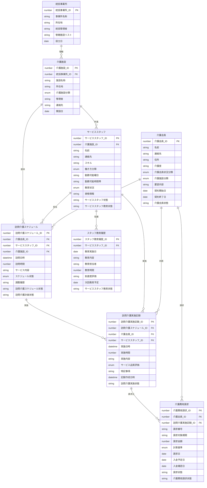

# 論理データモデル

## 概要
訪問介護スケジュール管理システムの論理データモデルを定義します。

## ER図

## 論理データ定義

### 介護会員
| 項目名 | タイプ | isKey | 説明 |
|--------|-------|-------|------|
| 介護会員_ID | number | true | 介護会員を一意に識別するID |
| 名前 | string | false | 介護会員の氏名 |
| 連絡先 | string | false | 電話番号やメールアドレスなどの連絡先 |
| 住所 | string | false | 介護会員の住所 |
| 介護度 | string | false | 要介護度のレベル |
| 介護会員状況分類 | enum | false | 未契約、契約中、契約終了、休止中 |
| 介護施設分類 | enum | false | 訪問介護専門、小規模多機能型、複合型 |
| 要望内容 | string | false | 介護会員の要望や希望事項 |
| 契約開始日 | date | false | サービス契約の開始日 |
| 契約終了日 | date | false | サービス契約の終了日 |
| 介護会員状態 | string | false | 入会申込中、審査中、利用可能、休止中、退会 |

### 訪問介護スケジュール
| 項目名 | タイプ | isKey | 説明 |
|--------|-------|-------|------|
| 訪問介護スケジュール_ID | number | true | 訪問介護スケジュールを一意に識別するID |
| 介護会員_ID | number | false | 介護会員を参照する外部キー |
| サービススタッフ_ID | number | false | 担当サービススタッフを参照する外部キー |
| 介護施設_ID | number | false | 介護施設を参照する外部キー |
| 訪問日時 | datetime | false | 訪問予定の日時 |
| 訪問時間 | number | false | 訪問予定の時間（分） |
| サービス内容 | string | false | 提供するサービスの内容 |
| スケジュール状態 | enum | false | 仮予約、確定、変更申請中、キャンセル |
| 調整履歴 | string | false | スケジュール調整の履歴 |
| 訪問介護スケジュール状態 | string | false | スケジュール作成中、調整中、確定、実施待ち、実施済み、キャンセル |
| 訪問介護計画状態 | string | false | 計画作成中、承認待ち、承認済み、実施中、完了、中止 |

### 訪問介護実施記録
| 項目名 | タイプ | isKey | 説明 |
|--------|-------|-------|------|
| 訪問介護実施記録_ID | number | true | 訪問介護実施記録を一意に識別するID |
| 訪問介護スケジュール_ID | number | false | 訪問介護スケジュールを参照する外部キー |
| 介護会員_ID | number | false | 介護会員を参照する外部キー |
| サービススタッフ_ID | number | false | 実施したサービススタッフを参照する外部キー |
| 実施日時 | datetime | false | 実際の実施日時 |
| 実施時間 | number | false | 実際の実施時間（分） |
| 実施内容 | string | false | 実施したサービスの詳細内容 |
| サービス品質評価 | enum | false | 優良、良好、要改善、問題あり |
| 特記事項 | string | false | 実施時の特記事項や注意点 |
| 記録作成日時 | datetime | false | 記録を作成した日時 |
| 訪問介護実施状態 | string | false | 未実施、実施中、記録作成中、記録承認待ち、完了 |

### 介護費用請求
| 項目名 | タイプ | isKey | 説明 |
|--------|-------|-------|------|
| 介護費用請求_ID | number | true | 介護費用請求を一意に識別するID |
| 介護会員_ID | number | false | 介護会員を参照する外部キー |
| 訪問介護実施記録_ID | number | false | 訪問介護実施記録を参照する外部キー |
| 請求番号 | string | false | 請求書の番号 |
| 請求対象期間 | string | false | 請求対象となる期間 |
| 請求金額 | number | false | 請求する金額 |
| 計算基準 | enum | false | 時間単価、回数単価、月額定額 |
| 請求日 | date | false | 請求書を発行した日 |
| 入金予定日 | date | false | 入金が予定されている日 |
| 入金確認日 | date | false | 入金を確認した日 |
| 請求状態 | string | false | 請求データ作成中、請求済み、入金確認中、入金完了、未回収 |
| 介護費用請求状態 | string | false | 請求データ作成中、請求済み、入金確認中、入金完了、未回収 |

### サービススタッフ
| 項目名 | タイプ | isKey | 説明 |
|--------|-------|-------|------|
| サービススタッフ_ID | number | true | サービススタッフを一意に識別するID |
| 介護施設_ID | number | false | 所属する介護施設を参照する外部キー |
| 名前 | string | false | サービススタッフの氏名 |
| 連絡先 | string | false | 電話番号やメールアドレスなどの連絡先 |
| スキル | string | false | 保有するスキルや資格 |
| 働き方分類 | enum | false | 正社員、契約社員、パートタイム、業務委託 |
| 勤務可能曜日 | string | false | 勤務可能な曜日 |
| 勤務可能時間帯 | string | false | 勤務可能な時間帯 |
| 教育状況 | enum | false | 未受講、受講中、合格、再教育必要 |
| 資格情報 | string | false | 保有する資格の情報 |
| サービススタッフ状態 | string | false | 登録申請中、在籍中、休職中、退職 |
| サービススタッフ教育状態 | string | false | 教育対象、教育中、試用期間、独り立ち、指導者認定 |

### スタッフ教育履歴
| 項目名 | タイプ | isKey | 説明 |
|--------|-------|-------|------|
| スタッフ教育履歴_ID | number | true | スタッフ教育履歴を一意に識別するID |
| サービススタッフ_ID | number | false | 教育対象のサービススタッフを参照する外部キー |
| 教育実施日 | date | false | 教育を実施した日 |
| 教育内容 | string | false | 実施した教育の内容 |
| 教育担当者 | string | false | 教育を担当したスタッフ |
| 教育時間 | number | false | 教育に要した時間（分） |
| 到達度評価 | string | false | 教育の到達度評価 |
| 次回教育予定 | date | false | 次回の教育予定日 |
| サービススタッフ教育状態 | string | false | 教育対象、教育中、試用期間、独り立ち、指導者認定 |

### 介護施設
| 項目名 | タイプ | isKey | 説明 |
|--------|-------|-------|------|
| 介護施設_ID | number | true | 介護施設を一意に識別するID |
| 統括事業所_ID | number | false | 統括事業所を参照する外部キー |
| 施設名称 | string | false | 介護施設の名称 |
| 所在地 | string | false | 介護施設の所在地 |
| 介護施設分類 | enum | false | 訪問介護専門、小規模多機能型、複合型 |
| 管理者 | string | false | 施設の管理者名 |
| 連絡先 | string | false | 施設の連絡先 |
| 開設日 | date | false | 施設の開設日 |

### 統括事業所
| 項目名 | タイプ | isKey | 説明 |
|--------|-------|-------|------|
| 統括事業所_ID | number | true | 統括事業所を一意に識別するID |
| 事業所名称 | string | false | 統括事業所の名称 |
| 所在地 | string | false | 統括事業所の所在地 |
| 統括管理者 | string | false | 統括管理者の氏名 |
| 管轄施設リスト | string | false | 管轄する施設のリスト |
| 設立日 | date | false | 事業所の設立日 |
