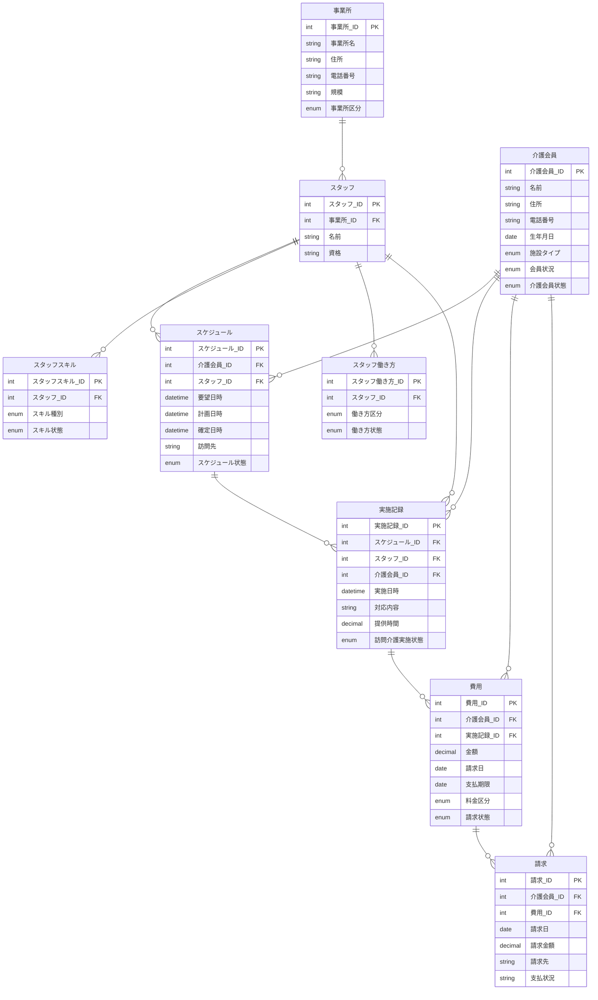

# 論理データモデル - 訪問介護システム

## 概要
訪問介護システムの「情報」オブジェクトから抽出した論理データモデルです。RDRA関連データの情報属性と情報間の関係を基に、正規化原則に従ってエンティティを設計しました。

---

## 論理データ構造

### 1. 事業所
事業所マスター情報：複数の事業所を一元管理する基本情報

| データ名 | 項目名 | タイプ | isKey | 説明 |
|---------|--------|--------|-------|------|
| 事業所 | 事業所_ID | number | true | 事業所の一意識別子 |
| 事業所 | 事業所名 | string | false | 事業所の名称 |
| 事業所 | 住所 | string | false | 事業所の住所 |
| 事業所 | 電話番号 | string | false | 事業所の電話番号 |
| 事業所 | 規模 | string | false | 事業所の規模 |
| 事業所 | 事業所区分 | [enum] | false | 拠点事業所、サテライト事業所 |

### 2. 介護会員
介護サービスの対象となる会員の基本情報

| データ名 | 項目名 | タイプ | isKey | 説明 |
|---------|--------|--------|-------|------|
| 介護会員 | 介護会員_ID | number | true | 介護会員の一意識別子 |
| 介護会員 | 名前 | string | false | 会員の名前 |
| 介護会員 | 住所 | string | false | 会員の住所 |
| 介護会員 | 電話番号 | string | false | 会員の連絡先電話番号 |
| 介護会員 | 生年月日 | string | false | 会員の生年月日 |
| 介護会員 | 施設タイプ | [enum] | false | 小規模施設、中規模施設、大規模施設 |
| 介護会員 | 会員状況 | [enum] | false | 相談中、契約待ち、サービス利用中、サービス終了、退会 |
| 介護会員 | 介護会員状態 | [enum] | false | 初期登録、情報確認、サービス利用中、サービス休止、サービス終了 |

### 3. スタッフ
訪問介護サービスを提供するスタッフの基本情報

| データ名 | 項目名 | タイプ | isKey | 説明 |
|---------|--------|--------|-------|------|
| スタッフ | スタッフ_ID | number | true | スタッフの一意識別子 |
| スタッフ | 事業所_ID | number | false | 所属事業所ID（事業所への外部キー） |
| スタッフ | 名前 | string | false | スタッフの名前 |
| スタッフ | 資格 | string | false | 保有資格 |

### 4. スタッフスキル
スタッフの保有スキル情報と認定状態を管理：スキル状態モデルのライフサイクルを追跡

| データ名 | 項目名 | タイプ | isKey | 説明 |
|---------|--------|--------|-------|------|
| スタッフスキル | スタッフスキル_ID | number | true | スキル記録の一意識別子 |
| スタッフスキル | スタッフ_ID | number | false | スタッフID（スタッフへの外部キー） |
| スタッフスキル | スキル種別 | [enum] | false | 介護助手、介護福祉士、看護師、その他 |
| スタッフスキル | スキル状態 | [enum] | false | 申告、確認、認定 |

### 5. スタッフ働き方
スタッフの柔軟な働き方希望と承認状態を管理：働き方状態モデルのライフサイクルを追跡

| データ名 | 項目名 | タイプ | isKey | 説明 |
|---------|--------|--------|-------|------|
| スタッフ働き方 | スタッフ働き方_ID | number | true | 働き方設定の一意識別子 |
| スタッフ働き方 | スタッフ_ID | number | false | スタッフID（スタッフへの外部キー） |
| スタッフ働き方 | 働き方区分 | [enum] | false | フルタイム、パートタイム、単発 |
| スタッフ働き方 | 働き方状態 | [enum] | false | 登録、審査、承認、実行 |

### 6. スケジュール
介護会員のサービス要望とスタッフのスキル・働き方に基づいて計画されるスケジュール：訪問介護実施の基盤

| データ名 | 項目名 | タイプ | isKey | 説明 |
|---------|--------|--------|-------|------|
| スケジュール | スケジュール_ID | number | true | スケジュールの一意識別子 |
| スケジュール | 介護会員_ID | number | false | 介護会員ID（介護会員への外部キー） |
| スケジュール | スタッフ_ID | number | false | スタッフID（スタッフへの外部キー） |
| スケジュール | 要望日時 | string | false | 会員からのサービス要望日時 |
| スケジュール | 計画日時 | string | false | スケジュール計画作成日時 |
| スケジュール | 確定日時 | string | false | スケジュール確定日時 |
| スケジュール | 訪問先 | string | false | 訪問先住所 |
| スケジュール | スケジュール状態 | [enum] | false | 計画、確定 |

### 7. 実施記録
訪問介護サービスの実施内容、時間、対応内容を記録：請求計算の基礎となる記録

| データ名 | 項目名 | タイプ | isKey | 説明 |
|---------|--------|--------|-------|------|
| 実施記録 | 実施記録_ID | number | true | 実施記録の一意識別子 |
| 実施記録 | スケジュール_ID | number | false | スケジュールID（スケジュールへの外部キー） |
| 実施記録 | スタッフ_ID | number | false | スタッフID（スタッフへの外部キー） |
| 実施記録 | 介護会員_ID | number | false | 介護会員ID（介護会員への外部キー） |
| 実施記録 | 実施日時 | string | false | 実際の訪問介護実施日時 |
| 実施記録 | 対応内容 | string | false | 提供した介護サービスの内容 |
| 実施記録 | 提供時間 | number | false | 提供時間（時間単位） |
| 実施記録 | 訪問介護実施状態 | [enum] | false | 計画、スタッフ確定、移動中、実施中、完了、記録確認 |

### 8. 費用
実施記録に基づいて月別に計算される介護費用：請求と回収の対象

| データ名 | 項目名 | タイプ | isKey | 説明 |
|---------|--------|--------|-------|------|
| 費用 | 費用_ID | number | true | 費用レコードの一意識別子 |
| 費用 | 介護会員_ID | number | false | 介護会員ID（介護会員への外部キー） |
| 費用 | 実施記録_ID | number | false | 実施記録ID（実施記録への外部キー） |
| 費用 | 金額 | number | false | 計算された介護費用金額 |
| 費用 | 請求日 | string | false | 費用の請求日 |
| 費用 | 支払期限 | string | false | 支払い期限日 |
| 費用 | 料金区分 | [enum] | false | 月額料金、従量制、混合料金 |
| 費用 | 請求状態 | [enum] | false | 計算済み、請求中、支払い待機、支払い完了 |

### 9. 請求
計算された介護費用の請求と回収を管理：支払い滞納時の対応も含む

| データ名 | 項目名 | タイプ | isKey | 説明 |
|---------|--------|--------|-------|------|
| 請求 | 請求_ID | number | true | 請求レコードの一意識別子 |
| 請求 | 介護会員_ID | number | false | 介護会員ID（介護会員への外部キー） |
| 請求 | 費用_ID | number | false | 費用ID（費用への外部キー） |
| 請求 | 請求日 | string | false | 実際の請求日 |
| 請求 | 請求金額 | number | false | 請求額（手数料等を含む） |
| 請求 | 請求先 | string | false | 請求先（会員名、手続き人等） |
| 請求 | 支払状況 | string | false | 支払い状況（支払い済み、未払い、滞納等） |

---

## エンティティ関連図（ER図）

---

## 設計の根拠

### 情報の属性構造分析
関連データの`#attribute`セクションから7つの主要「情報」オブジェクトを抽出し、その属性を論理データの項目として定義しました。

### 親子関係による正規化
- **スタッフスキル**：スタッフ情報の「スキル」属性が状態モデル（スタッフスキル状態：申告→確認→認定）を持つため独立
- **スタッフ働き方**：スタッフ情報の「働き方」属性が状態モデル（スタッフ働き方状態：登録→審査→承認→実行）を持つため独立
- **請求**：費用情報と関連し、請求・回収業務を独立管理

### 情報間の関連の実装
`#edge`セクションの「情報←→情報」関係を外部キーで実装：
- 介護会員情報 ← スケジュール情報（スケジュール.介護会員_ID）
- スタッフ情報 ← スケジュール情報、実施記録情報（FK）
- 実施記録情報 → 費用情報（費用.実施記録_ID）
- 費用情報 → 請求情報（請求.費用_ID）
- 事業所情報 ← スタッフ情報（スタッフ.事業所_ID）

### 状態管理の実装
状態モデルを表す列を各エンティティに配置：
- 介護会員.介護会員状態（介護会員状態モデル）
- スタッフスキル.スキル状態（スタッフスキル状態モデル）
- スタッフ働き方.働き方状態（スタッフ働き方状態モデル）
- スケジュール.スケジュール状態（スケジュール状態モデル）
- 実施記録.訪問介護実施状態（訪問介護実施状態モデル）
- 費用.請求状態（請求状態モデル）

### バリエーション属性の実装
バリエーションを列の列挙型（enum）として定義：
- 介護会員.施設タイプ、会員状況
- スタッフ.事業所_ID経由で事業所.事業所区分
- スタッフスキル.スキル種別
- スタッフ働き方.働き方区分
- 費用.料金区分
