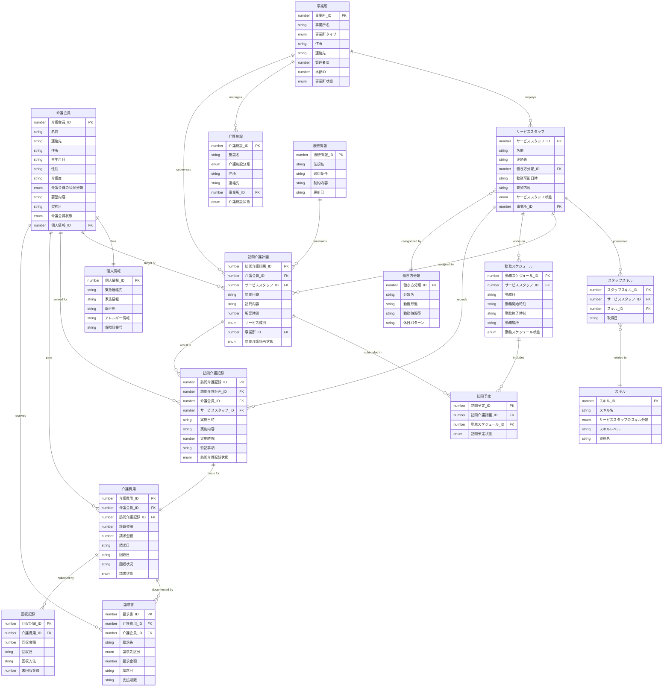

# 論理データモデル

## 1. ER図

## 2. 論理データ定義一覧

| データ名 | 項目名 | タイプ | isKey | 説明 |
| :--- | :--- | :--- | :--- | :--- |
| 介護会員 | 介護会員_ID | number | true | 会員を一意に識別するID |
| 介護会員 | 名前 | string | false | 会員の氏名 |
| 介護会員 | 連絡先 | string | false | 電話番号やメールアドレス |
| 介護会員 | 住所 | string | false | 居住地住所 |
| 介護会員 | 生年月日 | string | false | 会員の生年月日 |
| 介護会員 | 性別 | string | false | 性別 |
| 介護会員 | 介護度 | string | false | 現在の要介護度 |
| 介護会員 | 介護会員の状況分類 | enum | false | [要支援1, 要支援2, 要介護1, 要介護2, 要介護3, 要介護4, 要介護5] |
| 介護会員 | 要望内容 | string | false | サービスに対する要望 |
| 介護会員 | 契約日 | string | false | 契約開始日 |
| 介護会員 | 介護会員状態 | enum | false | [見込み, 契約中, 休止中, 解約済み] |
| 介護会員 | 個人情報_ID | number | false | 関連する個人情報のID |
| 個人情報 | 個人情報_ID | number | true | 個人情報を一意に識別するID |
| 個人情報 | 緊急連絡先 | string | false | 緊急時の連絡先情報 |
| 個人情報 | 家族情報 | string | false | 家族構成や連絡先 |
| 個人情報 | 既往歴 | string | false | 過去の病歴 |
| 個人情報 | アレルギー情報 | string | false | アレルギーに関する情報 |
| 個人情報 | 保険証番号 | string | false | 介護保険証などの番号 |
| サービススタッフ | サービススタッフ_ID | number | true | スタッフを一意に識別するID |
| サービススタッフ | 名前 | string | false | スタッフの氏名 |
| サービススタッフ | 連絡先 | string | false | 電話番号やメールアドレス |
| サービススタッフ | 働き方分類_ID | number | false | 働き方分類への参照ID |
| サービススタッフ | 勤務可能日時 | string | false | 勤務が可能な時間帯 |
| サービススタッフ | 要望内容 | string | false | 働き方に関する要望 |
| サービススタッフ | サービススタッフ状態 | enum | false | [登録中, 稼働可能, 稼働中, 休職中, 退職済み] |
| サービススタッフ | 事業所_ID | number | false | 所属する事業所のID |
| スタッフスキル | スタッフスキル_ID | number | true | スタッフとスキルの紐付けID |
| スタッフスキル | サービススタッフ_ID | number | false | スタッフID |
| スタッフスキル | スキル_ID | number | false | スキルID |
| スタッフスキル | 取得日 | string | false | スキルや資格の取得日 |
| スキル | スキル_ID | number | true | スキルを一意に識別するID |
| スキル | スキル名 | string | false | スキルの名称 |
| スキル | サービススタッフのスキル分類 | enum | false | [介護福祉士, ヘルパー1級, ヘルパー2級, 初任者研修修了, 実務者研修修了] |
| スキル | スキルレベル | string | false | 習熟度レベル |
| スキル | 資格名 | string | false | 正式な資格名称 |
| 働き方分類 | 働き方分類_ID | number | true | 働き方分類を一意に識別するID |
| 働き方分類 | 分類名 | string | false | 分類の名前（常勤フルタイム等） |
| 働き方分類 | 勤務形態 | string | false | 雇用形態や勤務形態 |
| 働き方分類 | 勤務時間帯 | string | false | 標準的な勤務時間帯 |
| 働き方分類 | 休日パターン | string | false | 標準的な休日設定 |
| 介護施設 | 介護施設_ID | number | true | 施設を一意に識別するID |
| 介護施設 | 施設名 | string | false | 施設の名称 |
| 介護施設 | 介護施設分類 | enum | false | [在宅, デイサービス, グループホーム, 特別養護老人ホーム] |
| 介護施設 | 住所 | string | false | 施設の所在地 |
| 介護施設 | 連絡先 | string | false | 施設の連絡先 |
| 介護施設 | 事業所_ID | number | false | 管理する事業所のID |
| 介護施設 | 介護施設状態 | enum | false | [検討中, 契約中, 休止中, 契約終了] |
| 事業所 | 事業所_ID | number | true | 事業所を一意に識別するID |
| 事業所 | 事業所名 | string | false | 事業所の名称 |
| 事業所 | 事業所タイプ | enum | false | [訪問介護事業所, 管理事業所] |
| 事業所 | 住所 | string | false | 事業所の所在地 |
| 事業所 | 連絡先 | string | false | 事業所の連絡先 |
| 事業所 | 管理者ID | number | false | 事業所管理者のユーザーID |
| 事業所 | 本部ID | number | false | 所属する本部のID |
| 事業所 | 事業所状態 | enum | false | [申請中, 稼働中, 休止中, 廃止] |
| 訪問介護計画 | 訪問介護計画_ID | number | true | 計画を一意に識別するID |
| 訪問介護計画 | 介護会員_ID | number | false | 対象の会員ID |
| 訪問介護計画 | サービススタッフ_ID | number | false | 担当スタッフID |
| 訪問介護計画 | 訪問日時 | string | false | 予定されている訪問日時 |
| 訪問介護計画 | 訪問内容 | string | false | 実施予定のサービス内容 |
| 訪問介護計画 | 所要時間 | number | false | 予定されている所要時間（分） |
| 訪問介護計画 | サービス種別 | enum | false | [身体介護, 生活援助, 通院介助, 夜間対応型訪問介護] |
| 訪問介護計画 | 事業所_ID | number | false | 担当する事業所のID |
| 訪問介護計画 | 訪問介護計画状態 | enum | false | [計画中, 承認待ち, 承認済み, 実施中, 完了, 変更中] |
| 勤務スケジュール | 勤務スケジュール_ID | number | true | スケジュールを一意に識別するID |
| 勤務スケジュール | サービススタッフ_ID | number | false | スタッフID |
| 勤務スケジュール | 勤務日 | string | false | 勤務年月日 |
| 勤務スケジュール | 勤務開始時刻 | string | false | 勤務開始予定時刻 |
| 勤務スケジュール | 勤務終了時刻 | string | false | 勤務終了予定時刻 |
| 勤務スケジュール | 勤務場所 | string | false | 勤務予定場所 |
| 勤務スケジュール | 勤務スケジュール状態 | enum | false | [作成中, 確定待ち, 確定, 実施中, 完了] |
| 訪問予定 | 訪問予定_ID | number | true | 訪問予定を一意に識別するID |
| 訪問予定 | 訪問介護計画_ID | number | false | 関連する計画ID |
| 訪問予定 | 勤務スケジュール_ID | number | false | 関連する勤務スケジュールID |
| 訪問予定 | 訪問予定状態 | enum | false | [予約済み, 確定, キャンセル, 訪問中, 完了] |
| 訪問介護記録 | 訪問介護記録_ID | number | true | 実施記録を一意に識別するID |
| 訪問介護記録 | 訪問介護計画_ID | number | false | 元になった計画ID |
| 訪問介護記録 | 介護会員_ID | number | false | 対象の会員ID |
| 訪問介護記録 | サービススタッフ_ID | number | false | 実施したスタッフID |
| 訪問介護記録 | 実施日時 | string | false | 実際に開始した日時 |
| 訪問介護記録 | 実施内容 | string | false | 実際に実施した内容 |
| 訪問介護記録 | 実施時間 | number | false | 実際にかかった時間（分） |
| 訪問介護記録 | 特記事項 | string | false | 実施時の特記事項 |
| 訪問介護記録 | 訪問介護記録状態 | enum | false | [記録中, 承認待ち, 承認済み] |
| 介護費用 | 介護費用_ID | number | true | 費用を一意に識別するID |
| 介護費用 | 介護会員_ID | number | false | 対象の会員ID |
| 介護費用 | 訪問介護記録_ID | number | false | 根拠となる記録ID |
| 介護費用 | 計算金額 | number | false | 算出された合計金額 |
| 介護費用 | 請求金額 | number | false | 実際に請求する金額 |
| 介護費用 | 請求日 | string | false | 請求を行った日 |
| 介護費用 | 回収日 | string | false | 費用を回収した日 |
| 介護費用 | 回収状況 | string | false | 回収の進捗状況 |
| 介護費用 | 請求状態 | enum | false | [未計算, 計算済み, 請求書発行済み, 入金済み, 督促中] |
| 請求書 | 請求書_ID | number | true | 請求書を一意に識別するID |
| 請求書 | 介護費用_ID | number | false | 関連する費用ID |
| 請求書 | 介護会員_ID | number | false | 請求先の会員ID |
| 請求書 | 請求先 | string | false | 請求書の送付先 |
| 請求書 | 請求先区分 | enum | false | [介護保険, 自費] |
| 請求書 | 請求金額 | number | false | 請求書に記載する金額 |
| 請求書 | 請求日 | string | false | 請求書発行日 |
| 請求書 | 支払期限 | string | false | 支払いの期限日 |
| 回収記録 | 回収記録_ID | number | true | 回収を一意に識別するID |
| 回収記録 | 介護費用_ID | number | false | 関連する費用ID |
| 回収記録 | 回収金額 | number | false | 実際に回収した金額 |
| 回収記録 | 回収日 | string | false | 回収日 |
| 回収記録 | 回収方法 | string | false | 回収手段（振込、引き落とし等） |
| 回収記録 | 未回収金額 | number | false | 残っている未回収の金額 |
| 法規情報 | 法規情報_ID | number | true | 法規を一意に識別するID |
| 法規情報 | 法規名 | string | false | 法律や規則の名称 |
| 法規情報 | 適用条件 | string | false | 法規が適用される条件 |
| 法規情報 | 制約内容 | string | false | 具体的な制限やルール |
| 法規情報 | 更新日 | string | false | 最終更新日 |
