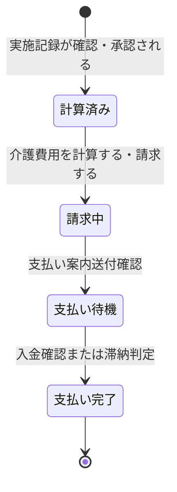

# ドメイン仕様書: 請求管理

## 1. 概要

### コンテキスト日本語名
請求管理

### コンテキスト英語名
BillingManagement

### 目的
実施記録に基づいて月別に介護費用を計算し、料金契約に応じて正確な請求金額を確定。請求と回収の進捗を管理し、支払い滞納時の対応記録を含めて、売上把握と入金を確実にする。

---

## 2. エンティティ定義

### 介護会員 (CareeMember)
介護サービスの対象となる会員の基本情報

| 項目名 | 型 | isKey | 説明 | 制約 |
|--------|-----|-------|------|------|
| 介護会員_ID | number | true | 介護会員の一意識別子 | PK |
| 名前 | string | - | 会員の名前 | NOT NULL |
| 住所 | string | - | 会員の住所 | NOT NULL |
| 電話番号 | string | - | 会員の連絡先電話番号 | NOT NULL |

**他コンテキスト参照**: CareeMemberManagement

### 実施記録 (ExecutionRecord)
訪問介護サービスの実施内容、時間、対応内容を記録

| 項目名 | 型 | isKey | 説明 | 制約 |
|--------|-----|-------|------|------|
| 実施記録_ID | number | true | 実施記録の一意識別子 | PK |
| スケジュール_ID | number | - | スケジュールID | FK to スケジュール |
| スタッフ_ID | number | - | 実施したスタッフID | FK to スタッフ |
| 介護会員_ID | number | - | 対象介護会員ID | FK to 介護会員 |
| 実施日時 | string | - | 実際の訪問介護実施日時 | NOT NULL |
| 対応内容 | string | - | 提供した介護サービスの内容 | NOT NULL |
| 提供時間 | number | - | 提供時間（時間単位） | NOT NULL |
| 訪問介護実施状態 | enum | - | 計画、スタッフ確定、移動中、実施中、完了、記録確認 | NOT NULL |

**他コンテキスト参照**: HomeVisitServiceExecution

### 費用 (Cost)
実施記録に基づいて月別に計算される介護費用。請求と回収の対象

| 項目名 | 型 | isKey | 説明 | 制約 |
|--------|-----|-------|------|------|
| 費用_ID | number | true | 費用レコードの一意識別子 | PK |
| 介護会員_ID | number | - | 介護会員ID | FK to 介護会員 |
| 実施記録_ID | number | - | 実施記録ID | FK to 実施記録 |
| 金額 | number | - | 計算された介護費用金額 | NOT NULL |
| 請求日 | string | - | 費用の請求日 | - |
| 支払期限 | string | - | 支払い期限日 | - |
| 料金区分 | enum | - | 月額料金、従量制、混合料金 | NOT NULL |
| 請求状態 | enum | - | 計算済み、請求中、支払い待機、支払い完了 | NOT NULL |

### 請求 (Invoice)
計算された介護費用の請求と回収を管理。支払い滞納時の対応も含む

| 項目名 | 型 | isKey | 説明 | 制約 |
|--------|-----|-------|------|------|
| 請求_ID | number | true | 請求レコードの一意識別子 | PK |
| 介護会員_ID | number | - | 介護会員ID | FK to 介護会員 |
| 費用_ID | number | - | 費用ID | FK to 費用 |
| 請求日 | string | - | 実際の請求日 | NOT NULL |
| 請求金額 | number | - | 請求額（手数料等を含む） | NOT NULL |
| 請求先 | string | - | 請求先（会員名、手続き人等） | NOT NULL |
| 支払状況 | string | - | 支払い状況（支払い済み、未払い、滞納等） | NOT NULL |

---

## 3. Value Objects / 列挙

### 料金区分 (BillingType)
介護会員との料金契約形態を分類

| 値 | 説明 | 計算方法 |
|----|------|---------|
| 月額料金 | 月額固定の料金契約 | 月額契約料金 × 契約月数 |
| 従量制 | 実施時間に応じた計算 | 実施時間 × 時間単価 + その他実費 |
| 混合料金 | 基本額と従量の組み合わせ | 基本月額 + (実施時間 - 基本時間) × 追加単価 |

### 請求状態 (BillingState)
費用計算から回収完了までのライフサイクル状態

| 値 | 説明 |
|----|------|
| 計算済み | 実施記録に基づいて月別費用を計算・確定した段階 |
| 請求中 | 請求書を発送し、支払いを催促中の段階 |
| 支払い待機 | 入金期限内の支払い待機段階 |
| 支払い完了 | 入金確認、売上計上完了 |

---

## 4. 状態モデル

### 請求状態 (BillingState)



**状態遷移説明**:

| 遷移前状態 | 遷移後状態 | トリガーUC | トリガー条件 |
|---------|---------|---------|----------|
| 計算済み | 請求中 | 介護費用を請求する | 請求書作成・発送完了 |
| 請求中 | 支払い待機 | 支払い案内送付 | 支払い案内送付確認 |
| 支払い待機 | 支払い完了 | 入金確認 / 滞納判定 | 入金確認 or 滞納判定 |

---

## 5. ビジネスルール

### 月別費用計算ルール
**目的**: 介護会員との料金契約に基づいて、月別に正確な介護費用を計算し、請求・回収業務の基盤とする

**適用タイミング**: 月初に当月分の実施記録を集計し、費用を計算

**対象エンティティ**: 費用、実施記録

| 料金区分 | 計算済み状態 | 請求中状態 | 支払い待機状態 | 支払い完了 |
|---------|-----------|----------|-----------|---------|
| 月額料金 | 一律計算 | 請求発送 | 回収確認 | 月末決済 |
| 従量制 | 実績×単価計算 | 請求発送 | 回収確認 | 都度決済 |
| 混合料金 | 基本額+実績加算 | 請求発送 | 回収確認 | 月末決済 |

**計算式**:
- **月額料金**: `月額契約料金 × 契約月数`
- **従量制**: `実施時間 × 時間単価 + その他実費`
- **混合料金**: `基本月額料金 + max(0, 実施時間 - 基本時間) × 追加単価`

**違反時の扱い**: 計算エラーを検出、再計算を実行

---

### 請求・回収業務管理
**目的**: 計算された介護費用の請求と回収を体系的に管理し、売上の把握と入金を確実にする

**適用タイミング**: 月次で請求状態を遷移させながら、支払い完了までの過程を管理

**対象エンティティ**: 請求、費用

| 請求状態 | 業務内容 | 実施部署 | 翌状態遷移条件 |
|---------|--------|--------|------------|
| 計算済み | 月別費用の確定 | 事務担当者 | 請求書作成完了 |
| 請求中 | 請求書発送・督促 | 事務担当者 | 支払い案内送付確認 |
| 支払い待機 | 入金確認・売上集計 | 事務担当者 | 入金確認または滞納判定 |
| 支払い完了 | 入金確認・売上計上 | 事業所管理者 | 会計期末閉鎖 |

**支払い滞納対応**:
- 支払い予定日から7日経過で催促対応開始
- 30日以上滞納時は電話・文書による回収活動を実施
- 滞納理由と対応経過を記録・管理

**違反時の扱い**: 滞納検出時にアラート表示、対応記録を強制

---

## 6. 不変条件と整合性制約

### 主キー一意性
- 費用_ID、請求_ID は各テーブルで一意

### 外部キー整合性
- 介護会員_ID は、CareeMemberManagement の介護会員テーブルに存在する ID を参照
- 実施記録_ID は、HomeVisitServiceExecution の実施記録テーブルに存在する ID を参照
- 費用_ID は、費用テーブルに存在する ID を参照

### 状態と属性の整合性

| 状態 | 必須属性 | 制約 |
|-----|--------|------|
| 計算済み | 介護会員_ID, 実施記録_ID, 金額, 料金区分 | 計算方式に応じた金額確定 |
| 請求中 | 請求日, 請求金額, 請求先 | 請求書発送確認 |
| 支払い待機 | 支払期限, 請求金額 | 期限内の回収待機 |
| 支払い完了 | すべての属性 | 入金確認、売上計上 |

### 費用と請求の対応
- 1つの費用レコード（費用_ID）に対して、1つ以上の請求レコード（請求_ID）が対応可能
- 費用.請求状態と請求.支払状況が一致していること

---

## 7. ドメインサービス

### 7.1. 費用計算サービス

#### CalculateMonthlyCost (月別費用計算)
**責務**: 実施記録に基づいて月別の介護費用を計算し、費用レコードを作成。状態を「計算済み」に設定

**入力 DTO**:
```
CalculateMonthlyCostRequest {
  careeMemberId: number (NOT NULL)
  targetMonth: string (NOT NULL, YYYY-MM形式)
  executionRecordIds: List<number> (NOT NULL)
  billingType: enum (NOT NULL)
  contractAmount: number (NOT NULL)
  hourlyRate: number (OPTIONAL, 従量制の場合)
  baseHours: number (OPTIONAL, 混合料金の場合)
}
```

**戻り値 DTO**:
```
CostCalculationResponse {
  costId: number
  careeMemberId: number
  careeMemberName: string
  targetMonth: string
  billingType: enum
  calculatedAmount: number
  executionHours: number
  calculationDetails: {
    baseAmount: number (OPTIONAL)
    additionalAmount: number (OPTIONAL)
  }
  billingState: enum = "計算済み"
  calculatedAt: datetime
}
```

**処理説明**:
1. 介護会員_ID の存在確認
2. 対象月の実施記録を抽出
3. 料金区分に応じて計算式を選択
4. 金額を計算：
   - 月額料金: 契約金額 × 契約月数
   - 従量制: 実施時間 × 時間単価
   - 混合料金: 基本額 + max(0, 実施時間 - 基本時間) × 追加単価
5. 費用レコードを作成
6. 状態を「計算済み」に設定
7. 計算日時を記録

---

#### ReviewCostCalculation (費用計算検証)
**責務**: 計算された費用が正確であることを確認

**入力 DTO**:
```
ReviewCostCalculationRequest {
  costId: number (NOT NULL)
  reviewerVerification: boolean (NOT NULL)
  reviewNotes: string (OPTIONAL)
}
```

**戻り値 DTO**:
```
CostCalculationResponse {
  costId: number
  careeMemberId: number
  targetMonth: string
  calculatedAmount: number
  billingState: enum = "計算済み"
  reviewedAt: datetime
  approvalStatus: enum (承認 | 修正要望)
}
```

**処理説明**:
1. 費用_ID の存在確認
2. 現在状態が「計算済み」であることを確認
3. 計算内容を検証
4. 検証結果を記録
5. 承認または修正要望を記録

---

### 7.2. 請求・回収管理サービス

#### IssueBillingInvoice (請求発行)
**責務**: 計算済みの費用に対して請求書を発行し、状態を「請求中」に遷移

**入力 DTO**:
```
IssueBillingInvoiceRequest {
  costId: number (NOT NULL)
  billingDate: string (NOT NULL)
  paymentDeadline: string (NOT NULL)
  billedTo: string (NOT NULL)
  additionalFees: number (OPTIONAL)
}
```

**戻り値 DTO**:
```
BillingInvoiceResponse {
  invoiceId: number
  careeMemberId: number
  careeMemberName: string
  billingDate: string
  invoiceAmount: number (請求額)
  paymentDeadline: string
  billedTo: string
  billingState: enum = "請求中"
  issuedAt: datetime
}
```

**処理説明**:
1. 費用_ID の存在確認
2. 状態が「計算済み」であることを確認
3. 費用レコードから計算金額を取得
4. 追加手数料があれば加算
5. 請求レコードを作成
6. 費用.請求状態を「請求中」に遷移
7. 請求.支払状況を「未払い」に設定
8. 請求書発行日時を記録
9. 請求書を生成・送付

---

#### ConfirmPaymentReceipt (入金確認)
**責務**: 請求金額の入金を確認し、状態を「支払い完了」に遷移。売上を計上

**入力 DTO**:
```
ConfirmPaymentReceiptRequest {
  invoiceId: number (NOT NULL)
  paymentDate: string (NOT NULL)
  paidAmount: number (NOT NULL)
  paymentMethod: enum (銀行振込 | 自動引き落とし | 現金 | その他)
  receiptReference: string (OPTIONAL)
}
```

**戻り値 DTO**:
```
PaymentReceiptResponse {
  invoiceId: number
  careeMemberId: number
  careeMemberName: string
  invoiceAmount: number
  paidAmount: number
  paymentDate: string
  paymentMethod: enum
  billingState: enum = "支払い完了"
  paymentStatus: enum = "支払い済み"
  confirmedAt: datetime
}
```

**処理説明**:
1. 請求_ID の存在確認
2. 現在状態が「支払い待機」であることを確認
3. 入金金額を確認
4. 請求額との一致を検証（差額がある場合はログ記録）
5. 支払い日を記録
6. 支払い状況を「支払い済み」に更新
7. 費用.請求状態を「支払い完了」に遷移
8. 売上計上フラグを設定
9. 入金確認日時を記録

---

#### HandlePaymentArrearage (支払い滞納対応)
**責務**: 支払い期限を超過した場合に滞納対応を記録し、回収活動を実施

**入力 DTO**:
```
HandlePaymentArrearageRequest {
  invoiceId: number (NOT NULL)
  arrearageDate: string (NOT NULL)
  daysOverdue: number (NOT NULL)
  collectionAction: enum (催促通知 | 電話催促 | 訪問催促)
  actionDetails: string (NOT NULL)
  nextActionDate: string (OPTIONAL)
}
```

**戻り値 DTO**:
```
PaymentArrearageResponse {
  invoiceId: number
  careeMemberId: number
  careeMemberName: string
  invoiceAmount: number
  arrearageAmount: number
  daysOverdue: number
  collectionAction: enum
  actionDetails: string
  nextActionScheduled: string
  recordedAt: datetime
  billingState: enum = "支払い待機"
  paymentStatus: enum = "滞納"
}
```

**処理説明**:
1. 請求_ID の存在確認
2. 支払期限との比較で滞納判定
3. 滞納日数を計算
4. 対応方法を記録
5. 対応内容の詳細を記録
6. 次回対応予定日を設定（あれば）
7. 請求.支払状況を「滞納」に更新
8. 滞納対応記録を作成
9. 支払い完了まで「支払い待機」状態を維持

---

## 8. コンテキスト境界と依存

### 他コンテキストとの情報依存

| 関連コンテキスト | 情報フロー | 用途 |
|-------------|---------|------|
| HomeVisitServiceExecution | 実施記録を参照 | 費用計算の基礎情報（実施時間、対応内容） |
| CareeMemberManagement | 介護会員情報を参照 | 請求先、料金区分情報取得 |

### 提供する情報
- 月別の費用計算情報
- 請求状態（計算済み、請求中、支払い完了）
- 請求額、支払い状況
- 売上情報

---

## 9. 実装 AI 向け指示

### 言語非依存の疑似シグネチャ

```
// 費用計算
calculateMonthlyCost(
  careeMemberId: number,
  targetMonth: string,
  executionRecordIds: List<number>,
  billingType: enum,
  contractAmount: number,
  hourlyRate: number,
  baseHours: number
) -> CostCalculationResponse

reviewCostCalculation(
  costId: number,
  reviewerVerification: boolean,
  reviewNotes: string
) -> CostCalculationResponse

// 請求・回収
issueBillingInvoice(
  costId: number,
  billingDate: string,
  paymentDeadline: string,
  billedTo: string,
  additionalFees: number
) -> BillingInvoiceResponse

confirmPaymentReceipt(
  invoiceId: number,
  paymentDate: string,
  paidAmount: number,
  paymentMethod: enum,
  receiptReference: string
) -> PaymentReceiptResponse

handlePaymentArrearage(
  invoiceId: number,
  arrearageDate: string,
  daysOverdue: number,
  collectionAction: enum,
  actionDetails: string,
  nextActionDate: string
) -> PaymentArrearageResponse
```

### トランザクション境界
- **原子単位**: 1つの月別費用計算 = 1トランザクション
- 請求発行時は、請求レコード作成 + 状態遷移 + 通知送付 = 1トランザクション内
- 入金確認時は、入金記録 + 売上計上 = 1トランザクション内

### バリデーション順序
1. 必須項目の NULL チェック
2. 参照整合性確認（介護会員_ID, 実施記録_ID が存在するか）
3. 状態遷移の前提条件確認（現在の状態が想定値か）
4. 金額計算の妥当性確認（料金区分に応じた計算方式選択）
5. 支払い期限の妥当性確認（支払い期限が請求日より後か）

### エラー分類

| エラー分類 | 例 | ハンドリング |
|---------|------|----------|
| **業務エラー** | 計算方式の選択エラー、重複請求 | ユーザーに通知、修正を促す |
| **整合性エラー** | 介護会員_ID が存在しない、実施記録未確定 | トランザクション롤백, ログ記録 |
| **外部連携エラー** | 決済システム連携失敗 | 再試行, 手動処理キュー |

---

## 10. Application 連携契約

### サービス一覧表

| サービス名 | メソッド名 | 入力 DTO | 戻り値 DTO | 変更対象エンティティ | 変更対象状態 | 発生し得るエラー分類 |
|---------|---------|---------|----------|------------|---------|-------------|
| 月別費用計算 | calculateMonthlyCost | CalculateMonthlyCostRequest | CostCalculationResponse | 費用 | 計算済み | 業務エラー、整合性エラー |
| 費用計算検証 | reviewCostCalculation | ReviewCostCalculationRequest | CostCalculationResponse | 費用 | 計算済み | 業務エラー |
| 請求発行 | issueBillingInvoice | IssueBillingInvoiceRequest | BillingInvoiceResponse | 費用、請求 | 計算済み→請求中 | 業務エラー |
| 入金確認 | confirmPaymentReceipt | ConfirmPaymentReceiptRequest | PaymentReceiptResponse | 費用、請求 | 支払い待機→支払い完了 | 業務エラー |
| 滞納対応 | handlePaymentArrearage | HandlePaymentArrearageRequest | PaymentArrearageResponse | 請求（滞納記録） | 支払い待機（継続） | 業務エラー |

### 参照操作（CRUD 読み取り）

| 操作 | メソッド名 | 検索条件 | 戻り値 | 用途 |
|-----|---------|--------|--------|------|
| 単件取得 | getCostById | costId | Cost | 費用詳細確認 |
| 会員別一覧 | listCostsByCareeMember | careeMemberId | List<Cost> | 会員の費用履歴確認 |
| 月別一覧 | listCostsByMonth | targetMonth | List<Cost> | 月別費用集計 |
| 請求一覧 | listInvoicesByStatus | billingState | List<Invoice> | 計算済み・請求中・支払い待機等を分類 |
| 滞納一覧 | listArrearages | なし | List<Invoice> | 滞納している請求を一覧表示 |
| 売上集計 | getMonthlyRevenue | targetMonth | RevenueAggregation | 月別売上の把握・分析 |

### 利用候補 UC

このドメイン契約を利用し得る UC：

- `介護費用を計算する` → calculateMonthlyCost
- `介護費用を請求する` → issueBillingInvoice
- `支払い状況を確認する` → listInvoicesByStatus, getMonthlyRevenue (参照)
- `売上を把握・管理する` → getMonthlyRevenue (参照)
- `支払い滞納に対応する` → handlePaymentArrearage, listArrearages (参照)

---
