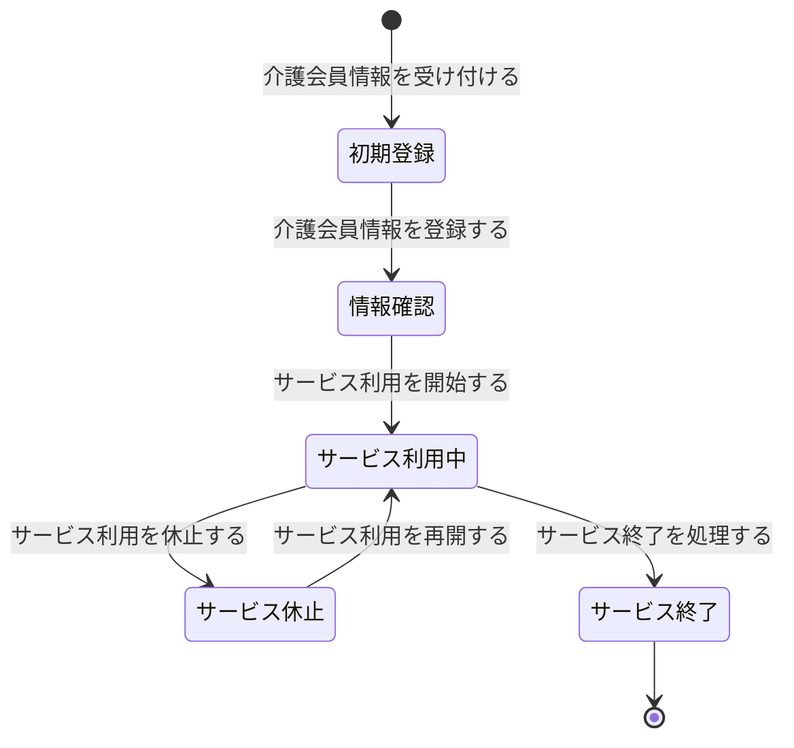

# ドメイン仕様書: 介護会員管理

## 1. 概要

### コンテキスト日本語名
介護会員管理

### コンテキスト英語名
CareeMemberManagement

### 目的
訪問介護サービスの対象となる介護会員の基本情報登録から利用終了まで、ライフサイクル全体を管理し、他のコンテキスト（スケジュール計画、請求管理）の基盤となる情報を正確に保持する。

---

## 2. エンティティ定義

### 事業所 (BusinessLocation)
複数の拠点事業所またはサテライト事業所を一元管理するためのマスター情報

| 項目名 | 型 | isKey | 説明 | 制約 |
|--------|-----|-------|------|------|
| 事業所_ID | number | true | 事業所の一意識別子 | PK |
| 事業所名 | string | - | 事業所の名称 | NOT NULL |
| 住所 | string | - | 事業所の住所 | NOT NULL |
| 電話番号 | string | - | 事業所の電話番号 | NOT NULL |
| 規模 | string | - | 事業所の規模 | - |
| 事業所区分 | enum | - | 拠点事業所、サテライト事業所 | NOT NULL |

**他コンテキスト参照**: StaffManagement → 事業所_ID (FK)

### 介護会員 (CareeMember)
介護サービスの対象となる会員の基本情報

| 項目名 | 型 | isKey | 説明 | 制約 |
|--------|-----|-------|------|------|
| 介護会員_ID | number | true | 介護会員の一意識別子 | PK |
| 名前 | string | - | 会員の名前 | NOT NULL |
| 住所 | string | - | 会員の住所 | NOT NULL |
| 電話番号 | string | - | 会員の連絡先電話番号 | NOT NULL |
| 生年月日 | string | - | 会員の生年月日 | NOT NULL |
| 施設タイプ | enum | - | 小規模施設、中規模施設、大規模施設 | NOT NULL |
| 会員状況 | enum | - | 相談中、契約待ち、サービス利用中、サービス終了、退会 | NOT NULL |
| 介護会員状態 | enum | - | 初期登録、情報確認、サービス利用中、サービス休止、サービス終了 | NOT NULL |

**他コンテキスト参照**:  
- ScheduleManagement → 介護会員_ID (FK)  
- HomeVisitServiceExecution → 介護会員_ID (FK)  
- BillingManagement → 介護会員_ID (FK)  

---

## 3. Value Objects / 列挙

### 会員状況 (MemberStatus)
介護会員のサービス契約と利用状態を表す値の集合

| 値 | 説明 |
|----|------|
| 相談中 | サービス検討・相談段階 |
| 契約待ち | 情報登録済み、契約手続き待機中 |
| サービス利用中 | 契約確定、サービス提供中 |
| サービス終了 | サービス利用終了、会員は系から除外 |
| 退会 | サービス利用終了、会員情報は削除対象 |

### 施設タイプ (FacilityType)
介護会員の属する施設の規模・特性を分類

| 値 | 説明 |
|----|------|
| 小規模施設 | 定員20人以下 |
| 中規模施設 | 定員21～50人 |
| 大規模施設 | 定員51人以上 |

### 介護会員状態 (CareeMemberState)
状態モデル「介護会員状態」に定義される状態値

| 値 | 説明 |
|----|------|
| 初期登録 | 会員情報の初期登録段階 |
| 情報確認 | 登録情報の確認・検証段階 |
| サービス利用中 | 契約確定、サービス提供実行中 |
| サービス休止 | サービス一時中断状態 |
| サービス終了 | 利用契約終了、ライフサイクル終了 |

---

## 4. 状態モデル

### 介護会員状態 (CareeMemberState)

状態遷移ダイアグラム：



**状態遷移説明**:

| 遷移前状態 | 遷移後状態 | トリガーUC | トリガー条件 |
|---------|---------|---------|----------|
| 初期登録 | 情報確認 | 介護会員情報を登録する | 基本情報入力完了 |
| 情報確認 | サービス利用中 | サービス利用を開始する | 情報確認完了、契約締結 |
| サービス利用中 | サービス休止 | サービス利用を休止する | 会員からの休止要望 |
| サービス休止 | サービス利用中 | サービス利用を再開する | 会員からの再開要望 |
| サービス利用中 | サービス終了 | サービス終了を処理する | 会員からの終了要望 |

---

## 5. ビジネスルール

### 介護会員属性多角管理
**目的**: 介護会員の属性情報を多角的に管理し、各ライフサイクルステージでの状態を正確に追跡

**適用タイミング**: 介護会員情報の登録・更新時

**対象エンティティ**: 介護会員

| ルール内容 | 対象状態 | 適用条件 |
|---------|--------|--------|
| 新規登録時は「会員状況=相談中」から開始 | 初期登録 | 登録初回 |
| 情報確認完了時に「会員状況=契約待ち」に遷移 | 情報確認 | 全必須項目入力 |
| 契約締結時に「会員状況=サービス利用中」に遷移 | サービス利用中 | 契約書署名完了 |
| 休止中の会員情報は変更不可（読み取り専用） | サービス休止 | 休止期間中 |
| 終了処理後は「会員状況=サービス終了」に確定 | サービス終了 | 終了処理完了 |

**違反時の扱い**: 状態遷移を許可しない、エラーメッセージを表示

---

## 6. 不変条件と整合性制約

### 主キー一意性
- 介護会員_ID は全体で一意
- 事業所_ID は全体で一意

### 外部キー整合性
- スケジュール、実施記録、費用、請求テーブルの介護会員_ID は、介護会員テーブルに存在する ID を参照すること
- スタッフテーブルの事業所_ID は、事業所テーブルに存在する ID を参照すること

### 状態と属性の整合性

| 状態 | 必須属性 | 制約 |
|-----|---------|------|
| 初期登録 | 基本情報（名前、住所、電話） | 最低限の情報のみ |
| 情報確認 | すべての基本情報 | 名前、生年月日、施設タイプ必須 |
| サービス利用中 | 完全な基本情報＋契約情報 | すべての属性が確定 |
| サービス休止 | 完全な基本情報 | 変更禁止、読み取り専用 |
| サービス終了 | 完全な基本情報＋終了理由 | 以降更新不可 |

### バリエーション制約
- 施設タイプの値は必ず「小規模施設」「中規模施設」「大規模施設」のいずれかに限定
- 会員状況の値は定義された5値のいずれかに限定

---

## 7. ドメインサービス

### 7.1. 介護会員情報の登録・更新サービス

#### RegisterCareeMemberInfo (新規登録)
**責務**: 介護会員の基本情報を初期登録し、介護会員状態を「初期登録」に遷移させる

**入力 DTO**:
```
RegisterCareeMemberInfoRequest {
  name: string (NOT NULL)
  address: string (NOT NULL)
  phoneNumber: string (NOT NULL)
  birthDate: string (NOT NULL)
  facilityType: enum (小規模施設 | 中規模施設 | 大規模施設)
  memberStatus: enum = "相談中" (初期値)
}
```

**戻り値 DTO**:
```
CareeMemberInfoResponse {
  careeMemberId: number
  name: string
  address: string
  phoneNumber: string
  birthDate: string
  facilityType: enum
  memberStatus: enum
  careeMemberState: enum = "初期登録"
  createdAt: datetime
}
```

**処理説明**:
1. 入力値の基本バリデーション（NULL チェック、形式チェック）
2. 電話番号、住所の正規化（スペース削除等）
3. 新規レコード作成（ID は自動採番）
4. 状態を「初期登録」に設定
5. 会員状況を「相談中」に設定
6. 作成日時を記録

**変更対象状態**: なし（新規作成）

**利用するビジネスルール**: 介護会員属性多角管理

---

#### UpdateCareeMemberInfo (情報更新)
**責務**: 登録済みの介護会員情報を更新し、必要に応じて状態を遷移

**入力 DTO**:
```
UpdateCareeMemberInfoRequest {
  careeMemberId: number (NOT NULL)
  name: string (OPTIONAL)
  address: string (OPTIONAL)
  phoneNumber: string (OPTIONAL)
  birthDate: string (OPTIONAL)
  facilityType: enum (OPTIONAL)
  memberStatus: enum (OPTIONAL)
}
```

**戻り値 DTO**:
```
CareeMemberInfoResponse {
  careeMemberId: number
  name: string
  address: string
  phoneNumber: string
  birthDate: string
  facilityType: enum
  memberStatus: enum
  careeMemberState: enum
  updatedAt: datetime
}
```

**処理説明**:
1. 介護会員_ID の存在確認
2. 現在の状態を取得（サービス休止中は更新禁止）
3. 入力値のバリデーション（提供された項目のみ）
4. レコードを更新
5. 更新日時を記録

**変更対象状態**: 状態遷移を伴わない場合が多いが、情報確認完了時は会員状況を「契約待ち」に自動遷移

**利用するビジネスルール**: 介護会員属性多角管理

---

### 7.2. 介護会員状態遷移サービス

#### StartServiceUse (サービス利用開始)
**責務**: 情報確認完了の介護会員に対してサービス利用を開始する状態遷移を実行

**入力 DTO**:
```
StartServiceUseRequest {
  careeMemberId: number (NOT NULL)
}
```

**戻り値 DTO**:
```
CareeMemberStateTransitionResponse {
  careeMemberId: number
  careeMemberState: enum = "サービス利用中"
  memberStatus: enum = "サービス利用中"
  transitionedAt: datetime
}
```

**処理説明**:
1. 介護会員_ID の存在確認
2. 現在状態が「情報確認」であることを確認
3. 会員状況が「契約待ち」であることを確認
4. 状態を「サービス利用中」に遷移
5. 会員状況を「サービス利用中」に遷移
6. 遷移日時を記録

**変更対象状態**: 介護会員状態（「情報確認」→「サービス利用中」）、 会員状況（「契約待ち」→「サービス利用中」）

**利用するビジネスルール**: 会員要望スケジュール対応

---

#### PauseServiceUse (サービス利用休止)
**責務**: サービス利用中の介護会員のサービス利用を一時中断

**入力 DTO**:
```
PauseServiceUseRequest {
  careeMemberId: number (NOT NULL)
  pauseReason: string (NOT NULL)
  estimatedResumeDate: string (OPTIONAL)
}
```

**戻り値 DTO**:
```
CareeMemberStateTransitionResponse {
  careeMemberId: number
  careeMemberState: enum = "サービス休止"
  pauseReason: string
  estimatedResumeDate: string
  pausedAt: datetime
}
```

**処理説明**:
1. 介護会員_ID の存在確認
2. 現在状態が「サービス利用中」であることを確認
3. 休止理由の記録
4. 復帰予定日を記録（あれば）
5. 状態を「サービス休止」に遷移
6. 休止日時を記録

**変更対象状態**: 介護会員状態（「サービス利用中」→「サービス休止」）

**利用するビジネスルール**: 会員要望スケジュール対応

---

#### ResumeServiceUse (サービス利用再開)
**責務**: サービス休止中の介護会員のサービス利用を再開

**入力 DTO**:
```
ResumeServiceUseRequest {
  careeMemberId: number (NOT NULL)
}
```

**戻り値 DTO**:
```
CareeMemberStateTransitionResponse {
  careeMemberId: number
  careeMemberState: enum = "サービス利用中"
  memberStatus: enum = "サービス利用中"
  resumedAt: datetime
}
```

**処理説明**:
1. 介護会員_ID の存在確認
2. 現在状態が「サービス休止」であることを確認
3. 状態を「サービス利用中」に遷移
4. 再開日時を記録

**変更対象状態**: 介護会員状態（「サービス休止」→「サービス利用中」）

**利用するビジネスルール**: 会員要望スケジュール対応

---

#### TerminateServiceUse (サービス終了処理)
**責務**: 介護会員のサービス利用契約を終了し、ライフサイクルを完了

**入力 DTO**:
```
TerminateServiceUseRequest {
  careeMemberId: number (NOT NULL)
  terminationReason: string (NOT NULL)
  terminationDate: string (NOT NULL)
}
```

**戻り値 DTO**:
```
CareeMemberStateTransitionResponse {
  careeMemberId: number
  careeMemberState: enum = "サービス終了"
  memberStatus: enum = "サービス終了"
  terminationReason: string
  terminationDate: string
}
```

**処理説明**:
1. 介護会員_ID の存在確認
2. 現在状態が「サービス利用中」または「サービス休止」であることを確認
3. 終了理由を記録
4. 終了日を設定
5. 状態を「サービス終了」に遷移
6. 会員状況を「サービス終了」に遷移
7. 以降、このレコードへの更新を禁止

**変更対象状態**: 介護会員状態（「サービス利用中」または「サービス休止」→「サービス終了」）、 会員状況（「サービス利用中」→「サービス終了」）

**利用するビジネスルール**: 介護会員属性多角管理

---

## 8. コンテキスト境界と依存

### 他コンテキストとの情報依存

| 関連コンテキスト | 情報フロー | 更新可否 |
|-------------|---------|--------|
| ScheduleManagement | 介護会員情報を参照（スケジュール計画に利用） | 参照のみ |
| HomeVisitServiceExecution | 介護会員情報を参照（実施記録に利用） | 参照のみ |
| BillingManagement | 介護会員情報を参照（請求先、料金区分に利用） | 参照のみ |
| BusinessLocationManagement | 事業所情報を参照（会員施設の管理） | 参照のみ |

### 参照可能情報
- 介護会員の基本情報（名前、住所、連絡先）
- 会員状況、施設タイプ
- 現在の状態（初期登録、情報確認、サービス利用中等）
- ただし、サービス休止中の会員情報は読み取り専用

---

## 9. 実装 AI 向け指示

### 言語非依存の疑似シグネチャ

```
// 新規登録
registerCareeMemberInfo(
  name: string,
  address: string,
  phoneNumber: string,
  birthDate: string,
  facilityType: enum
) -> (careeMemberId: number, careeMemberState: string)

// 情報更新
updateCareeMemberInfo(
  careeMemberId: number,
  updates: Map<string, any>
) -> CareeMemberInfo

// 状態遷移
startServiceUse(careeMemberId: number) -> CareeMemberInfo
pauseServiceUse(careeMemberId: number, pauseReason: string) -> CareeMemberInfo
resumeServiceUse(careeMemberId: number) -> CareeMemberInfo
terminateServiceUse(careeMemberId: number, reason: string, date: string) -> CareeMemberInfo
```

### トランザクション境界
- **原子単位**: 1つの状態遷移 = 1トランザクション
- 基本情報更新と状態遷移が同時の場合、1トランザクション内で両方を実行

### バリデーション順序
1. 必須項目の NULL チェック
2. データ型の形式チェック（電話番号、生年月日等）
3. 状態遷移の前提条件確認（現在の状態が想定値か）
4. ビジネスルールの適用判定（介護会員属性多角管理など）

### エラー分類

| エラー分類 | 例 | ハンドリング |
|---------|------|----------|
| **業務エラー** | サービス休止中の更新要求 | ユーザーに通知、操作取消し |
| **整合性エラー** | 外部キー参照先の削除 | トランザクション롤백, ログ記録 |
| **外部連携エラー | 事業所マスター未同期 | 再試行, フォールバック |

---

## 10. Application 連携契約

このドメイン層で提供されるサービス契約を、Application 層が参照するための仕様です。

### サービス一覧表

| サービス名 | メソッド名 | 入力 DTO | 戻り値 DTO | 変更対象エンティティ | 変更対象状態 | 発生し得るエラー分類 |
|---------|---------|---------|----------|------------|---------|-------------|
| 介護会員情報の登録 | registerCareeMemberInfo | RegisterCareeMemberInfoRequest | CareeMemberInfoResponse | 介護会員 | 初期登録 | 業務エラー、整合性エラー |
| 介護会員情報の更新 | updateCareeMemberInfo | UpdateCareeMemberInfoRequest | CareeMemberInfoResponse | 介護会員 | 情報確認 | 業務エラー、整合性エラー |
| サービス利用開始 | startServiceUse | StartServiceUseRequest | CareeMemberStateTransitionResponse | 介護会員 | 情報確認→サービス利用中 | 業務エラー |
| サービス利用休止 | pauseServiceUse | PauseServiceUseRequest | CareeMemberStateTransitionResponse | 介護会員 | サービス利用中→サービス休止 | 業務エラー |
| サービス利用再開 | resumeServiceUse | ResumeServiceUseRequest | CareeMemberStateTransitionResponse | 介護会員 | サービス休止→サービス利用中 | 業務エラー |
| サービス終了 | terminateServiceUse | TerminateServiceUseRequest | CareeMemberStateTransitionResponse | 介護会員 | サービス利用中等→サービス終了 | 業務エラー |

### 参照操作（CRUD 読み取り）

| 操作 | メソッド名 | 検索条件 | 戻り値 | 用途 |
|-----|---------|--------|--------|------|
| 単件取得 | getCareeMemberInfoById | careeMemberId | CareeMemberInfo | スケジュール計画画面で会員情報を参照 |
| 一覧取得 | listCareeMembersWithStatus | memberStatus, facilityType | List<CareeMemberInfo> | 介護会員一覧画面で絞り込み検索 |
| 検索 | searchCareeMembersByName | name (部分一致) | List<CareeMemberInfo> | 会員検索 |
| 状態別一覧 | getCareeMembersByState | careeMemberState | List<CareeMemberInfo> | 状態別レポート |

### 利用候補 UC

このドメイン契約を利用し得る UC：

- `介護会員情報を受け付ける` → registerCareeMemberInfo
- `介護会員情報を登録する` → registerCareeMemberInfo, updateCareeMemberInfo
- `介護会員情報を更新する` → updateCareeMemberInfo
- `サービス利用を開始する` → startServiceUse
- `サービス利用を休止する` → pauseServiceUse
- `サービス利用を再開する` → resumeServiceUse
- `サービス終了を処理する` → terminateServiceUse
- `スケジュール要望を確認する` → getCareeMemberInfoById (参照)
- `スケジュールを計画する` → listCareeMembersWithStatus (参照)
- `支払い状況を確認する` → getCareeMemberInfoById (参照)

---
