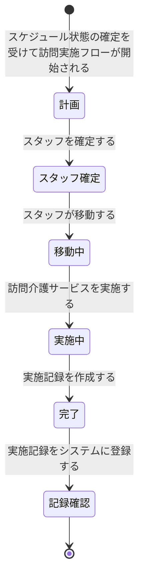

# ドメイン仕様書: 訪問介護実施

## 1. 概要

### コンテキスト日本語名
訪問介護実施

### コンテキスト英語名
HomeVisitServiceExecution

### 目的
計画されたスケジュール通りに訪問介護サービスを実施し、実施内容・時間・対応内容を統一された形式で記録して、請求計算と品質管理の基盤となる実施記録を管理する。

---

## 2. エンティティ定義

### スケジュール (Schedule)
介護会員のサービス要望とスタッフのスキル・働き方に基づいて計画されるスケジュール

| 項目名 | 型 | isKey | 説明 | 制約 |
|--------|-----|-------|------|------|
| スケジュール_ID | number | true | スケジュールの一意識別子 | PK |
| 介護会員_ID | number | - | 介護会員ID | FK to 介護会員 |
| スタッフ_ID | number | - | 配置するスタッフID | FK to スタッフ |
| 要望日時 | string | - | 会員からのサービス要望日時 | NOT NULL |
| 計画日時 | string | - | スケジュール計画作成日時 | - |
| 確定日時 | string | - | スケジュール確定日時 | - |
| 訪問先 | string | - | 訪問先住所 | NOT NULL |
| スケジュール状態 | enum | - | 計画、確定 | NOT NULL |

**他コンテキスト参照**: ScheduleManagement

### 介護会員 (CareeMember)
介護サービスの対象となる会員の基本情報

| 項目名 | 型 | isKey | 説明 | 制約 |
|--------|-----|-------|------|------|
| 介護会員_ID | number | true | 介護会員の一意識別子 | PK |
| 名前 | string | - | 会員の名前 | NOT NULL |
| 住所 | string | - | 会員の住所 | NOT NULL |
| 電話番号 | string | - | 会員の連絡先電話番号 | NOT NULL |

**他コンテキスト参照**: CareeMemberManagement

### スタッフ (Staff)
訪問介護サービスを提供するスタッフの基本情報

| 項目名 | 型 | isKey | 説明 | 制約 |
|--------|-----|-------|------|------|
| スタッフ_ID | number | true | スタッフの一意識別子 | PK |
| 事業所_ID | number | - | 所属事業所ID | FK to 事業所 |
| 名前 | string | - | スタッフの名前 | NOT NULL |
| 資格 | string | - | 保有資格 | NOT NULL |

**他コンテキスト参照**: StaffManagement

### 実施記録 (ExecutionRecord)
訪問介護サービスの実施内容、時間、対応内容を記録。請求計算の基礎となる記録

| 項目名 | 型 | isKey | 説明 | 制約 |
|--------|-----|-------|------|------|
| 実施記録_ID | number | true | 実施記録の一意識別子 | PK |
| スケジュール_ID | number | - | スケジュールID | FK to スケジュール |
| スタッフ_ID | number | - | 実施したスタッフID | FK to スタッフ |
| 介護会員_ID | number | - | 対象介護会員ID | FK to 介護会員 |
| 実施日時 | string | - | 実際の訪問介護実施日時 | NOT NULL |
| 対応内容 | string | - | 提供した介護サービスの内容 | NOT NULL |
| 提供時間 | number | - | 提供時間（時間単位） | NOT NULL |
| 訪問介護実施状態 | enum | - | 計画、スタッフ確定、移動中、実施中、完了、記録確認 | NOT NULL |

---

## 3. Value Objects / 列挙

### 訪問介護実施状態 (HomeVisitExecutionState)
訪問介護実施のライフサイクル状態

| 値 | 説明 |
|----|------|
| 計画 | スケジュール確定、訪問実施前の準備段階 |
| スタッフ確定 | スタッフが訪問割り当てを確認した段階 |
| 移動中 | スタッフが訪問先に向けて移動中 |
| 実施中 | 訪問介護サービスを提供中 |
| 完了 | サービス提供終了、実施記録作成準備段階 |
| 記録確認 | 実施記録が確認・承認された段階。請求対象確定 |

---

## 4. 状態モデル

### 訪問介護実施状態 (HomeVisitExecutionState)



**状態遷移説明**:

| 遷移前状態 | 遷移後状態 | トリガーUC | トリガー条件 |
|---------|---------|---------|----------|
| 計画 | スタッフ確定 | スタッフを確定する | スケジュール確定から訪問実施フロー開始 |
| スタッフ確定 | 移動中 | スタッフが移動する | 訪問時刻に向けて移動開始 |
| 移動中 | 実施中 | 訪問介護サービスを実施する | 訪問先到着、サービス開始 |
| 実施中 | 完了 | 実施記録を作成する | サービス提供終了 |
| 完了 | 記録確認 | 実施記録をシステムに登録する | 記録がシステムに登録 |

---

## 5. ビジネスルール

### 訪問実施スケジュール確認
**目的**: 計画されたスケジュール通りに訪問介護サービスが実施されていることを確認し、サービス品質を保証

**適用タイミング**: 訪問介護実施中～完了段階

**対象エンティティ**: 実施記録、スケジュール

| 訪問介護実施状態 | 確認項目 | 実施確認内容 |
|------------|---------|----------|
| 計画段階 | 訪問予定確認 | 計画書の最終確認 |
| スタッフ確定 | 配置確認 | 確定スタッフの配置確認 |
| 移動中 | 移動報告 | リアルタイム位置情報 |
| 実施中 | サービス記録 | 実施内容のリアルタイム記録 |
| 完了 | 完了報告 | サービス終了確認 |
| 記録確認 | 記録検証 | 実施内容と記録の整合性確認 |

**ルール**: 計画と実施内容に乖離がある場合は事前に報告し、品質管理を実施

**違反時の扱い**: 計画との乖離をシステムが検出、警告とログ記録

---

### 実施記録必須項目
**目的**: 訪問介護サービスの実施内容を統一された形式で記録し、請求計算と品質管理の基盤とする

**適用タイミング**: サービス実施時の各段階（実施中→完了→記録確認）

**対象エンティティ**: 実施記録

| 訪問介護実施状態 | 必須記録項目 | 記録担当 |
|------------|----------|--------|
| 実施中 | • 訪問日時<br/>• スタッフ名<br/>• 対応内容（カテゴリー） | サービススタッフ |
| 完了 | • 提供時間（正確な開始・終了時刻）<br/>• 対応内容詳細<br/>• 特記事項 | サービススタッフ |
| 記録確認 | • 記録の正確性確認<br/>• 請求対象確認<br/>• 承認サイン | 事務担当者 |

**ルール**: すべての項目が記入されない限り、記録は「完了」から「記録確認」に遷移できない

**違反時の扱い**: 未入力項目をシステムが検出、画面に警告表示

---

## 6. 不変条件と整合性制約

### 主キー一意性
- 実施記録_ID は全体で一意

### 外部キー整合性
- スケジュール_ID は、ScheduleManagement のスケジュールテーブルに存在する ID を参照
- スタッフ_ID は、StaffManagement のスタッフテーブルに存在する ID を参照
- 介護会員_ID は、CareeMemberManagement の介護会員テーブルに存在する ID を参照

### 状態と属性の整合性

| 状態 | 必須属性 | 制約 |
|-----|--------|------|
| 計画 | スケジュール_ID | スケジュール確定済み |
| スタッフ確定 | スタッフ_ID | スタッフが割り当て確認済み |
| 移動中 | 移動報告時刻 | リアルタイム位置情報あり |
| 実施中 | 実施開始日時、対応内容（基本） | サービス提供中 |
| 完了 | 実施終了日時、提供時間、対応内容詳細 | すべて記入済み |
| 記録確認 | 請求対象確認、承認者サイン | 事務担当者の確認済み |

### スケジュールと実施記録の整合性
- 1つのスケジュール_ID に対して、1つの実施記録（実施記録_ID）が対応
- スケジュール確定日時と実施日時の乖離がある場合はログ記録
- スケジュール上のスタッフ_ID と実施記録上のスタッフ_ID が異なる場合は理由を記録

---

## 7. ドメインサービス

### 7.1. 訪問実施管理サービス

#### ConfirmStaffAssignment (スタッフ確定)
**責務**: スタッフが訪問割り当てを確認し、実施状態を「スタッフ確定」に遷移

**入力 DTO**:
```
ConfirmStaffAssignmentRequest {
  scheduleId: number (NOT NULL)
  staffId: number (NOT NULL)
  confirmationDateTime: string (NOT NULL)
}
```

**戻り値 DTO**:
```
ExecutionStatusResponse {
  executionRecordId: number
  scheduleId: number
  staffId: number
  staffName: string
  visitDateTime: string
  visitAddress: string
  executionState: enum = "スタッフ確定"
  confirmedAt: datetime
}
```

**処理説明**:
1. スケジュール_ID の存在確認
2. スケジュール状態が「確定」であることを確認
3. スタッフ_ID の一致確認
4. 実施記録を作成（状態=「計画」）
5. 状態を「スタッフ確定」に遷移
6. 確認日時を記録

---

#### ReportStaffMovement (移動報告)
**責務**: スタッフが訪問先に向けて移動中であることを報告し、状態を「移動中」に遷移

**入力 DTO**:
```
ReportStaffMovementRequest {
  executionRecordId: number (NOT NULL)
  currentLocation: string (OPTIONAL)
  estimatedArrivalTime: string (OPTIONAL)
  reportDateTime: string (NOT NULL)
}
```

**戻り値 DTO**:
```
ExecutionStatusResponse {
  executionRecordId: number
  scheduleId: number
  staffId: number
  currentLocation: string
  estimatedArrivalTime: string
  executionState: enum = "移動中"
  reportedAt: datetime
}
```

**処理説明**:
1. 実施記録_ID の存在確認
2. 現在状態が「スタッフ確定」であることを確認
3. 状態を「移動中」に遷移
4. 現在地情報を記録（あれば）
5. 予定到着時刻を記録（あれば）
6. 報告日時を記録

---

#### StartServiceExecution (サービス実施開始)
**責務**: 訪問先到着後、訪問介護サービスの提供を開始し、リアルタイム記録を開始。状態を「実施中」に遷移

**入力 DTO**:
```
StartServiceExecutionRequest {
  executionRecordId: number (NOT NULL)
  actualArrivalTime: string (NOT NULL)
  serviceStartTime: string (NOT NULL)
  initialServiceContent: string (NOT NULL)
}
```

**戻り値 DTO**:
```
ExecutionStatusResponse {
  executionRecordId: number
  scheduleId: number
  staffId: number
  actualArrivalTime: string
  serviceStartTime: string
  executionState: enum = "実施中"
  startedAt: datetime
}
```

**処理説明**:
1. 実施記録_ID の存在確認
2. 現在状態が「移動中」であることを確認
3. 実際到着時刻を記録
4. サービス開始時刻を記録
5. 対応内容（基本）を記録
6. 状態を「実施中」に遷移
7. 実施開始日時を記録

---

#### CompleteServiceExecution (サービス完了)
**責務**: 訪問介護サービスの提供を完了し、実施内容の詳細記録を作成。状態を「完了」に遷移

**入力 DTO**:
```
CompleteServiceExecutionRequest {
  executionRecordId: number (NOT NULL)
  serviceEndTime: string (NOT NULL)
  providedDuration: number (NOT NULL)
  detailedServiceContent: string (NOT NULL)
  specialNotes: string (OPTIONAL)
}
```

**戻り値 DTO**:
```
ExecutionStatusResponse {
  executionRecordId: number
  scheduleId: number
  staffId: number
  serviceEndTime: string
  providedDuration: number (時間)
  detailedServiceContent: string
  specialNotes: string
  executionState: enum = "完了"
  completedAt: datetime
}
```

**処理説明**:
1. 実施記録_ID の存在確認
2. 現在状態が「実施中」であることを確認
3. サービス終了時刻を記録
4. 提供時間を計算・記録
5. 対応内容詳細を記録
6. 特記事項を記録（あれば）
7. 状態を「完了」に遷移
8. 完了日時を記録

---

### 7.2. 実施記録管理サービス

#### RegisterExecutionRecord (実施記録登録)
**責務**: サービススタッフが作成した実施記録をシステムに登録し、事務担当者の確認対象にする。状態を「記録確認」に遷移

**入力 DTO**:
```
RegisterExecutionRecordRequest {
  executionRecordId: number (NOT NULL)
  allRequiredFieldsFilled: boolean (NOT NULL)
  staffSignature: string (OPTIONAL)
}
```

**戻り値 DTO**:
```
ExecutionStatusResponse {
  executionRecordId: number
  scheduleId: number
  staffId: number
  careeMemberId: number
  executionState: enum = "記録確認"
  registeredAt: datetime
  pendingApproval: boolean = true
}
```

**処理説明**:
1. 実施記録_ID の存在確認
2. 必須項目の入力状況をチェック
3. すべての必須項目が入力されていることを確認
4. スタッフの署名（確認）を記録
5. 状態を「記録確認」に遷移
6. 登録日時を記録
7. 事務担当者への確認通知を送付

---

#### VerifyExecutionRecord (実施記録確認)
**責務**: 事務担当者が実施記録を確認・検証し、請求対象かどうかを判定

**入力 DTO**:
```
VerifyExecutionRecordRequest {
  executionRecordId: number (NOT NULL)
  billingTarget: boolean (NOT NULL)
  verificationNotes: string (OPTIONAL)
  approverSignature: string (NOT NULL)
}
```

**戻り値 DTO**:
```
ExecutionVerificationResponse {
  executionRecordId: number
  billingTarget: boolean
  verificationNotes: string
  verificationDateTime: datetime
  approverName: string
}
```

**処理説明**:
1. 実施記録_ID の存在確認
2. 現在状態が「記録確認」であることを確認
3. 実施内容の正確性を確認
4. 請求対象となるかどうかを判定
5. 確認者の署名を記録
6. 検証日時を記録
7. 請求対象判定結果を記録
8. BillingManagement への通知準備

---

## 8. コンテキスト境界と依存

### 他コンテキストとの情報依存

| 関連コンテキスト | 情報フロー | 用途 |
|-------------|---------|------|
| ScheduleManagement | スケジュール情報を参照 | 訪問予定、スタッフ確定情報の基準 |
| CareeMemberManagement | 介護会員情報を参照 | 会員の確認、連絡先確認 |
| StaffManagement | スタッフ情報を参照 | スタッフ確認、資格確認 |
| BillingManagement | 実施記録を提供 | 請求計算の基礎情報 |

### 参照可能情報
- スケジュール確定情報（訪問日時、訪問先、スタッフ確定）
- 介護会員の基本情報と現在の状態
- スタッフの基本情報と資格

---

## 9. 実装 AI 向け指示

### 言語非依存の疑似シグネチャ

```
// 訪問実施管理
confirmStaffAssignment(
  scheduleId: number,
  staffId: number,
  confirmationDateTime: string
) -> ExecutionStatusResponse

reportStaffMovement(
  executionRecordId: number,
  currentLocation: string,
  estimatedArrivalTime: string,
  reportDateTime: string
) -> ExecutionStatusResponse

startServiceExecution(
  executionRecordId: number,
  actualArrivalTime: string,
  serviceStartTime: string,
  initialServiceContent: string
) -> ExecutionStatusResponse

completeServiceExecution(
  executionRecordId: number,
  serviceEndTime: string,
  providedDuration: number,
  detailedServiceContent: string,
  specialNotes: string
) -> ExecutionStatusResponse

// 実施記録管理
registerExecutionRecord(
  executionRecordId: number,
  allRequiredFieldsFilled: boolean,
  staffSignature: string
) -> ExecutionStatusResponse

verifyExecutionRecord(
  executionRecordId: number,
  billingTarget: boolean,
  verificationNotes: string,
  approverSignature: string
) -> ExecutionVerificationResponse
```

### トランザクション境界
- **原子単位**: 1つのサービス実施 = 1トランザクション
- 実施記録登録時は、記録作成 + 状態遷移 + 通知送付 = 1トランザクション内

### バリデーション順序
1. 必須項目の NULL チェック
2. 参照整合性確認（スケジュール_ID, スタッフ_ID, 介護会員_ID が存在するか）
3. 状態遷移の前提条件確認（現在の状態が想定値か）
4. スケジュール確定情報との整合性確認（スタッフ, 日時）
5. 必須記録項目の完全性確認

### エラー分類

| エラー分類 | 例 | ハンドリング |
|---------|------|----------|
| **業務エラー** | 必須項目未入力、請求対象判定エラー | ユーザーに通知、修正を促す |
| **整合性エラー** | スケジュール_ID が存在しない、スタッフ不一致 | トランザクション롤백, ログ記録 |
| **外部連携エラー** | BillingManagement との連携失敗 | 再試行, 手動確認キュー |

---

## 10. Application 連携契約

### サービス一覧表

| サービス名 | メソッド名 | 入力 DTO | 戻り値 DTO | 変更対象エンティティ | 変更対象状態 | 発生し得るエラー分類 |
|---------|---------|---------|----------|------------|---------|-------------|
| スタッフ確定 | confirmStaffAssignment | ConfirmStaffAssignmentRequest | ExecutionStatusResponse | 実施記録 | 計画→スタッフ確定 | 業務エラー、整合性エラー |
| 移動報告 | reportStaffMovement | ReportStaffMovementRequest | ExecutionStatusResponse | 実施記録 | スタッフ確定→移動中 | 業務エラー |
| サービス実施開始 | startServiceExecution | StartServiceExecutionRequest | ExecutionStatusResponse | 実施記録 | 移動中→実施中 | 業務エラー |
| サービス完了 | completeServiceExecution | CompleteServiceExecutionRequest | ExecutionStatusResponse | 実施記録 | 実施中→完了 | 業務エラー |
| 実施記録登録 | registerExecutionRecord | RegisterExecutionRecordRequest | ExecutionStatusResponse | 実施記録 | 完了→記録確認 | 業務エラー |
| 実施記録確認 | verifyExecutionRecord | VerifyExecutionRecordRequest | ExecutionVerificationResponse | 実施記録 | 記録確認（検証） | 業務エラー |

### 参照操作（CRUD 読み取り）

| 操作 | メソッド名 | 検索条件 | 戻り値 | 用途 |
|-----|---------|--------|--------|------|
| 単件取得 | getExecutionRecordById | executionRecordId | ExecutionRecord | 実施記録詳細確認 |
| スケジュール別一覧 | listExecutionRecordsBySchedule | scheduleId | List<ExecutionRecord> | スケジュールの実施状況確認 |
| スタッフ別一覧 | listExecutionRecordsByStaff | staffId | List<ExecutionRecord> | スタッフの実施履歴確認 |
| 日時範囲検索 | searchExecutionRecordsByDateRange | startDateTime, endDateTime | List<ExecutionRecord> | 期間別実施記録検索 |
| 未確認一覧 | listPendingVerificationRecords | なし | List<ExecutionRecord> | 事務担当者の確認待ち記録 |

### 利用候補 UC

このドメイン契約を利用し得る UC：

- `スタッフを確定する` → confirmStaffAssignment
- `スタッフが移動する` → reportStaffMovement
- `訪問介護サービスを実施する` → startServiceExecution, completeServiceExecution
- `実施記録を作成する` → completeServiceExecution (記録作成を含む)
- `実施記録をシステムに登録する` → registerExecutionRecord
- `実施記録を確認する` → verifyExecutionRecord, listPendingVerificationRecords (参照)
- `介護費用を計算する` → listExecutionRecordsBySchedule (参照)

---
