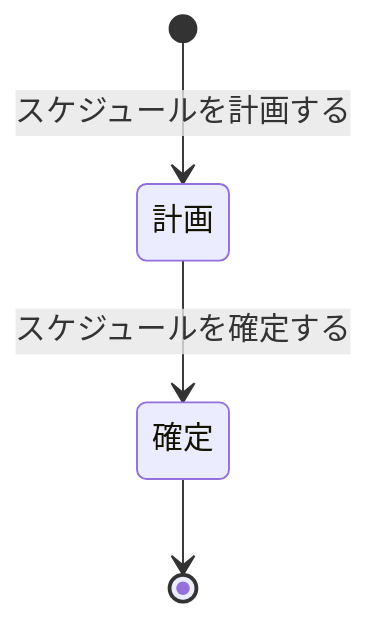

# ドメイン仕様書: スケジュール管理

## 1. 概要

### コンテキスト日本語名
スケジュール管理

### コンテキスト英語名
ScheduleManagement

### 目的
介護会員のサービス要望とスタッフのスキル・働き方に基づいて訪問介護スケジュールを計画・確定し、訪問介護実施の基盤情報を提供する。スケジュール変更要望への対応と調整困難時の判定を含む。

---

## 2. エンティティ定義

### 介護会員 (CareeMember)
介護サービスの対象となる会員の基本情報

| 項目名 | 型 | isKey | 説明 | 制約 |
|--------|-----|-------|------|------|
| 介護会員_ID | number | true | 介護会員の一意識別子 | PK |
| 名前 | string | - | 会員の名前 | NOT NULL |
| 住所 | string | - | 会員の住所 | NOT NULL |
| 電話番号 | string | - | 会員の連絡先電話番号 | NOT NULL |
| 会員状況 | enum | - | 相談中、契約待ち、サービス利用中、サービス終了、退会 | NOT NULL |
| 介護会員状態 | enum | - | 初期登録、情報確認、サービス利用中、サービス休止、サービス終了 | NOT NULL |

**他コンテキスト参照**: CareeMemberManagement

### スタッフ (Staff)
訪問介護サービスを提供するスタッフの基本情報

| 項目名 | 型 | isKey | 説明 | 制約 |
|--------|-----|-------|------|------|
| スタッフ_ID | number | true | スタッフの一意識別子 | PK |
| 事業所_ID | number | - | 所属事業所ID | FK to 事業所 |
| 名前 | string | - | スタッフの名前 | NOT NULL |
| 資格 | string | - | 保有資格 | NOT NULL |

**他コンテキスト参照**: StaffManagement

### スケジュール (Schedule)
介護会員のサービス要望とスタッフのスキル・働き方に基づいて計画されるスケジュール。訪問介護実施の基盤

| 項目名 | 型 | isKey | 説明 | 制約 |
|--------|-----|-------|------|------|
| スケジュール_ID | number | true | スケジュールの一意識別子 | PK |
| 介護会員_ID | number | - | 介護会員ID | FK to 介護会員 |
| スタッフ_ID | number | - | 配置するスタッフID | FK to スタッフ |
| 要望日時 | string | - | 会員からのサービス要望日時 | NOT NULL |
| 計画日時 | string | - | スケジュール計画作成日時 | - |
| 確定日時 | string | - | スケジュール確定日時 | - |
| 訪問先 | string | - | 訪問先住所 | NOT NULL |
| スケジュール状態 | enum | - | 計画、確定 | NOT NULL |

---

## 3. Value Objects / 列挙

### スケジュール状態 (ScheduleState)
スケジュール計画のライフサイクル状態

| 値 | 説明 |
|----|------|
| 計画 | スケジュール計画作成中、確定前の段階 |
| 確定 | スケジュールが公式に確定された段階。訪問実施の基準となる |

---

## 4. 状態モデル

### スケジュール状態 (ScheduleState)



**状態遷移説明**:

| 遷移前状態 | 遷移後状態 | トリガーUC | トリガー条件 |
|---------|---------|---------|----------|
| 計画 | 確定 | スケジュールを確定する | 計画案の妥当性確認、稟議承認 |

---

## 5. ビジネスルール

### 会員要望スケジュール対応
**目的**: 介護会員の要望に応じて、スケジュール計画・確定を柔軟に対応させ、顧客満足度を維持

**適用タイミング**: スケジュール計画・変更時

**対象エンティティ**: スケジュール、介護会員状態

| 介護会員状態 | 計画段階での対応 | 確定段階での対応 |
|---------|-----------|-----------|
| 初期登録 | 要望聴取準備中 | 不可（未対象） |
| 情報確認 | 要望確認可能 | 要望反映可 |
| サービス利用中 | 要望確認可能（最優先） | 確定後対応困難（要確認） |
| サービス休止 | 要望確認保留 | 対応不可 |
| サービス終了 | 対応不可 | 対応不可 |

**ルール**: 「サービス利用中」かつ「計画段階」の場合、介護会員の要望を最優先に対応する

**違反時の扱い**: 要望への対応可否をシステムが判定、不可の場合は理由をスタッフに通知

---

### スタッフスキル別業務配分
**目的**: スタッフのスキルに応じて、提供できる介護業務を適切に配分し、サービス品質を確保

**適用タイミング**: スケジュール計画時（スタッフ確定時）

**対象エンティティ**: スケジュール、スタッフスキル

| スキル状態 | 配置可能 | 配分ルール |
|---------|--------|---------|
| 申告 | × | スケジュール計画に利用不可 |
| 確認 | △ | 確認中のため注意が必要 |
| 認定 | ◎ | スキル種別に応じて業務配分可能 |

**違反時の扱い**: 認定済みスキル以外のスタッフを選択した場合、警告メッセージを表示

---

### スタッフ働き方柔軟設定
**目的**: スタッフの働き方希望を尊重し、勤務形態ごとの制約を遵守してスケジュール計画

**適用タイミング**: スケジュール計画時

**対象エンティティ**: スケジュール、スタッフ働き方

| 働き方区分 | 配置制約 | スケジュール計画時の注意 |
|---------|--------|---------|
| フルタイム | 同一事業所に常時配置 | 勤務日以外は配置不可 |
| パートタイム | 複数事業所対応可、時間制限あり | 契約時間数を超えないか確認 |
| 単発 | 1日単位で都度確認 | 案件ごとに別途承認が必要 |

**違反時の扱い**: 働き方制約を超える計画案を検出した場合、警告と修正提案

---

### スケジュール調整可能性判定
**目的**: 介護会員からのスケジュール変更要望に対して、調整可能性を事前に判定し、対応可否を迅速に決定

**適用タイミング**: スケジュール変更要望受付時

**対象エンティティ**: スケジュール状態

| スケジュール状態 | 調整可能性 | 対応内容 |
|-------------|---------|--------|
| 計画段階 | ◎調整可能 | 要望を反映した計画修正 |
| 確定段階 | △限定的 | スタッフ配置状況確認後対応 |
| 確定翌日以降 | ×困難 | 変更不可、次回以降対応提案 |

**判定ロジック**: 現在日時とスケジュール確定日時の差分により判定

**違反時の扱い**: 調整困難時は対応協議画面に遷移、代案を提案

---

## 6. 不変条件と整合性制約

### 主キー一意性
- スケジュール_ID は全体で一意

### 外部キー整合性
- 介護会員_ID は、CareeMemberManagement の介護会員テーブルに存在する ID を参照
- スタッフ_ID は、StaffManagement のスタッフテーブルに存在する ID を参照

### 状態と属性の整合性

| 状態 | 必須属性 | 制約 |
|-----|--------|------|
| 計画 | 介護会員_ID, 要望日時, 訪問先 | スタッフ_ID は未決定でも可 |
| 確定 | すべての属性（介護会員_ID, スタッフ_ID, 確定日時等） | スタッフ確定済み、日時確定済み |

### スケジュール計画の整合性
- 1つの介護会員に対して、複数のスケジュール（スケジュール_ID）が存在することは可能
- ただし、同じ時間帯に複数のスケジュールが確定しないこと
- スタッフも同様に、同じ時間帯に複数のスケジュールが確定しないこと

---

## 7. ドメインサービス

### 7.1. スケジュール計画サービス

#### PlanSchedule (計画作成)
**責務**: 介護会員の要望とスタッフのスキル・働き方を考慮してスケジュール計画を作成

**入力 DTO**:
```
PlanScheduleRequest {
  careeMemberId: number (NOT NULL)
  requestedDateTime: string (NOT NULL)
  visitAddress: string (NOT NULL)
  preferredStaffIds: List<number> (OPTIONAL)
}
```

**戻り値 DTO**:
```
ScheduleInfoResponse {
  scheduleId: number
  careeMemberId: number
  careeMemberName: string
  requestedDateTime: string
  plannedDateTime: string (計画案の日時)
  visitAddress: string
  candidateStaffIds: List<number> (推奨スタッフ)
  scheduleState: enum = "計画"
  createdAt: datetime
}
```

**処理説明**:
1. 介護会員_ID の存在確認
2. 会員状態が「サービス利用中」以上であることを確認
3. 要望日時のバリデーション
4. スタッフスキル、働き方の制約を考慮して候補スタッフを抽出
5. スケジュール計画レコード作成
6. 状態を「計画」に設定
7. 計画作成日時を記録

---

#### UpdateSchedulePlan (計画修正)
**責務**: 計画段階のスケジュール計画を修正

**入力 DTO**:
```
UpdateSchedulePlanRequest {
  scheduleId: number (NOT NULL)
  updates: {
    requestedDateTime: string (OPTIONAL)
    visitAddress: string (OPTIONAL)
    preferredStaffIds: List<number> (OPTIONAL)
  }
}
```

**戻り値 DTO**:
```
ScheduleInfoResponse {
  scheduleId: number
  careeMemberId: number
  careeMemberName: string
  requestedDateTime: string
  plannedDateTime: string
  visitAddress: string
  candidateStaffIds: List<number>
  scheduleState: enum = "計画"
  updatedAt: datetime
}
```

**処理説明**:
1. スケジュール_ID の存在確認
2. 現在状態が「計画」であることを確認
3. 提供された項目のみを更新
4. スタッフ候補を再抽出
5. 更新日時を記録

---

### 7.2. スケジュール確定サービス

#### ConfirmSchedule (確定実行)
**責務**: 計画されたスケジュールを確定し、訪問実施の基準を確定。スタッフに通知

**入力 DTO**:
```
ConfirmScheduleRequest {
  scheduleId: number (NOT NULL)
  assignedStaffId: number (NOT NULL)
  confirmationDate: string (NOT NULL)
}
```

**戻り値 DTO**:
```
ScheduleInfoResponse {
  scheduleId: number
  careeMemberId: number
  careeMemberName: string
  assignedStaffId: number
  assignedStaffName: string
  confirmedDateTime: string
  visitAddress: string
  scheduleState: enum = "確定"
  confirmedAt: datetime
}
```

**処理説明**:
1. スケジュール_ID, スタッフ_ID の存在確認
2. 現在状態が「計画」であることを確認
3. スタッフのスキル状態が「認定」であることを確認
4. スタッフの働き方制約を検証（時間数、曜日等）
5. 時間帯の重複がないことを確認
6. 状態を「確定」に遷移
7. スタッフ_ID を確定
8. 確定日時を記録
9. 介護会員とスタッフに確定通知を送付

---

### 7.3. スケジュール変更・調整サービス

#### RequestScheduleChange (変更要望受付)
**責務**: 介護会員からのスケジュール変更要望を受け付け、対応可否を判定

**入力 DTO**:
```
RequestScheduleChangeRequest {
  scheduleId: number (NOT NULL)
  changeReason: string (NOT NULL)
  preferredDateTime: string (OPTIONAL)
}
```

**戻り値 DTO**:
```
ScheduleChangeResponse {
  changeRequestId: number
  scheduleId: number
  changeReason: string
  adjustabilityJudgment: enum (調整可能 | 限定的 | 困難)
  adjustabilityMessage: string
  requestedAt: datetime
}
```

**処理説明**:
1. スケジュール_ID の存在確認
2. 現在状態を取得
3. スケジュール調整可能性判定を実行
4. 調整可否を返却
5. 調整困難な場合は対応協議画面へ誘導

---

#### AdjustSchedule (スケジュール調整)
**責務**: 確定したスケジュールを確認し、変更要望に基づいて調整実施

**入力 DTO**:
```
AdjustScheduleRequest {
  scheduleId: number (NOT NULL)
  newDateTime: string (NOT NULL)
  newStaffId: number (OPTIONAL)
  adjustmentReason: string (NOT NULL)
}
```

**戻り値 DTO**:
```
ScheduleInfoResponse {
  scheduleId: number
  careeMemberId: number
  careeMemberName: string
  assignedStaffId: number
  confirmedDateTime: string
  visitAddress: string
  scheduleState: enum = "確정"
  adjustedAt: datetime
}
```

**処理説明**:
1. スケジュール_ID の存在確認
2. 現在状態が「確定」であることを確認
3. スケジュール調整可能性判定を実行（「計画段階」のみ調整可能）
4. 新しい日時とスタッフ制約を検証
5. スケジュール情報を更新
6. 調整理由を記録
7. 調整通知を送付

---

#### HandleAdjustmentDifficulty (調整困難時対応)
**責務**: 調整困難な状況を記録し、代案を提案

**入力 DTO**:
```
HandleAdjustmentDifficultyRequest {
  scheduleId: number (NOT NULL)
  changeReason: string (NOT NULL)
  responseOption: enum (代案受け入れ | 変更延期 | キャンセル)
  negotiationNotes: string (OPTIONAL)
}
```

**戻り値 DTO**:
```
AdjustmentDifficultyResponse {
  scheduleId: number
  originalDateTime: string
  proposedAlternativeDateTime: string (代案日時)
  responseOption: enum
  resolvedAt: datetime
}
```

**処理説明**:
1. スケジュール_ID の存在確認
2. 調整困難な理由を分析
3. 代案を生成（スタッフ・日時の別案）
4. 対応方法を記録
5. 介護会員への対応説明を作成
6. 対応結果を記録

---

## 8. コンテキスト境界と依存

### 他コンテキストとの情報依存

| 関連コンテキスト | 情報フロー | 用途 |
|-------------|---------|------|
| CareeMemberManagement | 介護会員情報、状態を参照 | スケジュール計画の対象会員確認、状態による対応判定 |
| StaffManagement | スタッフ情報、スキル状態、働き方状態を参照 | スタッフ候補抽出、スキル・働き方制約検証 |
| HomeVisitServiceExecution | スケジュール情報を提供 | 訪問実施の基準情報 |

### 参照可能情報
- 会員の基本情報と現在状態（サービス利用中か等）
- スタッフの認定スキル（スキル状態=「認定」のみ）
- スタッフの実行中の働き方設定（働き方状態=「実行」のみ）
- スケジュールの確定状態

---

## 9. 実装 AI 向け指示

### 言語非依存の疑似シグネチャ

```
// スケジュール計画
planSchedule(
  careeMemberId: number,
  requestedDateTime: string,
  visitAddress: string,
  preferredStaffIds: List<number>
) -> ScheduleInfoResponse

updateSchedulePlan(
  scheduleId: number,
  updates: Map<string, any>
) -> ScheduleInfoResponse

// スケジュール確定
confirmSchedule(
  scheduleId: number,
  assignedStaffId: number,
  confirmationDate: string
) -> ScheduleInfoResponse

// スケジュール変更・調整
requestScheduleChange(
  scheduleId: number,
  changeReason: string,
  preferredDateTime: string
) -> ScheduleChangeResponse

adjustSchedule(
  scheduleId: number,
  newDateTime: string,
  newStaffId: number,
  adjustmentReason: string
) -> ScheduleInfoResponse

handleAdjustmentDifficulty(
  scheduleId: number,
  changeReason: string,
  responseOption: enum,
  negotiationNotes: string
) -> AdjustmentDifficultyResponse
```

### トランザクション境界
- **原子単位**: 1つのスケジュール計画 = 1トランザクション
- スケジュール確定時は、スケジュール更新 + 通知送付 = 1トランザクション内

### バリデーション順序
1. 必須項目の NULL チェック
2. 参照整合性確認（会員_ID, スタッフ_ID が存在するか）
3. 状態遷移の前提条件確認（現在の状態が想定値か）
4. ビジネスルール適用（会員要望対応、スキル別配分、働き方制約など）
5. 重複チェック（同じ時間帯に複数スケジュールが確定していないか）

### エラー分類

| エラー分類 | 例 | ハンドリング |
|---------|------|----------|
| **業務エラー** | 認定済みスキルなしのスタッフ配置、働き方時間超過 | ユーザーに警告、修正を促す |
| **整合性エラー** | 会員_ID が存在しない、スケジュール確定日時が過去 | トランザクション롤백, ログ記録 |
| **外部連携エラー** | スタッフ情報未同期 | 再試行, フォールバック |

---

## 10. Application 連携契約

### サービス一覧表

| サービス名 | メソッド名 | 入力 DTO | 戻り値 DTO | 変更対象エンティティ | 変更対象状態 | 発生し得るエラー分類 |
|---------|---------|---------|----------|------------|---------|-------------|
| スケジュール計画作成 | planSchedule | PlanScheduleRequest | ScheduleInfoResponse | スケジュール | 計画 | 業務エラー、整合性エラー |
| スケジュール計画修正 | updateSchedulePlan | UpdateSchedulePlanRequest | ScheduleInfoResponse | スケジュール | 計画 | 業務エラー |
| スケジュール確定 | confirmSchedule | ConfirmScheduleRequest | ScheduleInfoResponse | スケジュール | 計画→確定 | 業務エラー |
| スケジュール変更要望受付 | requestScheduleChange | RequestScheduleChangeRequest | ScheduleChangeResponse | なし（判定のみ） | - | - |
| スケジュール調整実施 | adjustSchedule | AdjustScheduleRequest | ScheduleInfoResponse | スケジュール | 確定（修正） | 業務エラー |
| 調整困難時対応 | handleAdjustmentDifficulty | HandleAdjustmentDifficultyRequest | AdjustmentDifficultyResponse | なし（記録） | - | 業務エラー |

### 参照操作（CRUD 読み取り）

| 操作 | メソッド名 | 検索条件 | 戻り値 | 用途 |
|-----|---------|--------|--------|------|
| 単件取得 | getScheduleById | scheduleId | ScheduleInfo | スケジュール詳細確認 |
| 会員別一覧 | listSchedulesByCareeMember | careeMemberId | List<ScheduleInfo> | 会員のスケジュール一覧表示 |
| スタッフ別一覧 | listSchedulesByStaff | staffId | List<ScheduleInfo> | スタッフの勤務スケジュール表示 |
| 状態別一覧 | listSchedulesByState | scheduleState | List<ScheduleInfo> | 計画中・確定済みのスケジュール分類 |
| 日時範囲検索 | searchSchedulesByDateRange | startDateTime, endDateTime | List<ScheduleInfo> | 期間別スケジュール検索 |

### 利用候補 UC

このドメイン契約を利用し得る UC：

- `スケジュール要望を確認する` → planSchedule (参照)
- `スケジュールを計画する` → planSchedule, updateSchedulePlan
- `スケジュールを確定する` → confirmSchedule
- `スケジュール変更要望を受け付ける` → requestScheduleChange
- `スケジュールを調整する` → adjustSchedule, handleAdjustmentDifficulty
- `スケジュール調整困難時の対応を行う` → handleAdjustmentDifficulty
- `スタッフを確定する` → confirmSchedule (スタッフ確定を含む)
- `訪問介護サービスを実施する` → listSchedulesByStaff (参照)

---
