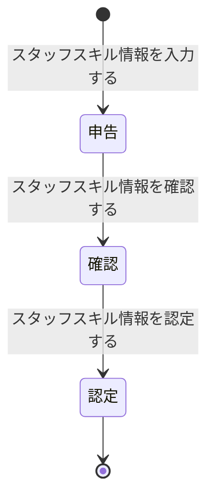
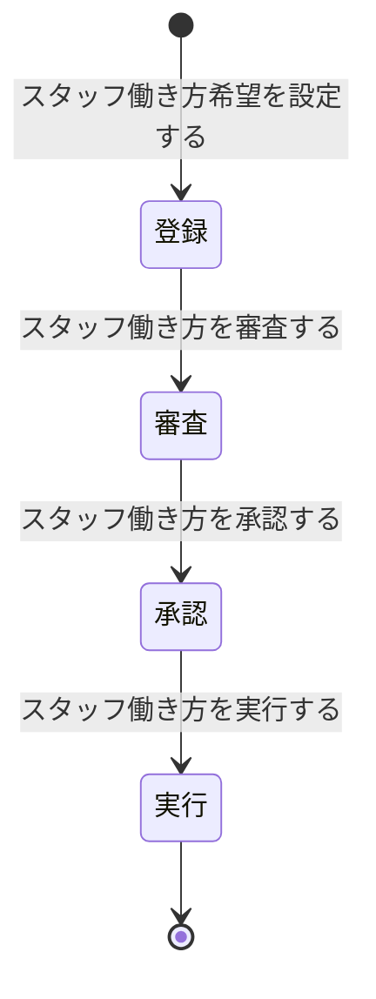

# ドメイン仕様書: スタッフ管理

## 1. 概要

### コンテキスト日本語名
スタッフ管理

### コンテキスト英語名
StaffManagement

### 目的
訪問介護サービスを提供するスタッフの基本情報管理、スキル認定、柔軟な働き方設定を統合して管理し、スケジュール計画で適切な人員配置を実現するための基盤情報を提供する。

---

## 2. エンティティ定義

### 事業所 (BusinessLocation)
複数の拠点事業所またはサテライト事業所を一元管理するためのマスター情報

| 項目名 | 型 | isKey | 説明 | 制約 |
|--------|-----|-------|------|------|
| 事業所_ID | number | true | 事業所の一意識別子 | PK |
| 事業所名 | string | - | 事業所の名称 | NOT NULL |
| 住所 | string | - | 事業所の住所 | NOT NULL |
| 電話番号 | string | - | 事業所の電話番号 | NOT NULL |
| 規模 | string | - | 事業所の規模 | - |
| 事業所区分 | enum | - | 拠点事業所、サテライト事業所 | NOT NULL |

**他コンテキスト参照**: 事業所は複数のスタッフを管理

### スタッフ (Staff)
訪問介護サービスを提供するスタッフの基本情報

| 項目名 | 型 | isKey | 説明 | 制約 |
|--------|-----|-------|------|------|
| スタッフ_ID | number | true | スタッフの一意識別子 | PK |
| 事業所_ID | number | - | 所属事業所ID | FK to 事業所 |
| 名前 | string | - | スタッフの名前 | NOT NULL |
| 資格 | string | - | 保有資格 | NOT NULL |

**他コンテキスト参照**:  
- ScheduleManagement → スタッフ_ID (FK)  
- HomeVisitServiceExecution → スタッフ_ID (FK)  

### スタッフスキル (StaffSkill)
スタッフの保有スキル情報と認定状態を管理。スキル状態モデル（申告→確認→認定）のライフサイクルを追跡

| 項目名 | 型 | isKey | 説明 | 制約 |
|--------|-----|-------|------|------|
| スタッフスキル_ID | number | true | スキル記録の一意識別子 | PK |
| スタッフ_ID | number | - | スタッフID | FK to スタッフ |
| スキル種別 | enum | - | 介護助手、介護福祉士、看護師、その他 | NOT NULL |
| スキル状態 | enum | - | 申告、確認、認定 | NOT NULL |

### スタッフ働き方 (StaffWorkingStyle)
スタッフの柔軟な働き方希望と承認状態を管理。働き方状態モデル（登録→審査→承認→実行）のライフサイクルを追跡

| 項目名 | 型 | isKey | 説明 | 制約 |
|--------|-----|-------|------|------|
| スタッフ働き方_ID | number | true | 働き方設定の一意識別子 | PK |
| スタッフ_ID | number | - | スタッフID | FK to スタッフ |
| 働き方区分 | enum | - | フルタイム、パートタイム、単発 | NOT NULL |
| 働き方状態 | enum | - | 登録、審査、承認、実行 | NOT NULL |

---

## 3. Value Objects / 列挙

### スキル種別 (SkillType)
スタッフが保有する介護スキルの分類

| 値 | 説明 | 対応可能業務 |
|----|------|---------|
| 介護助手 | 基本的な身体介護・生活援助 | 軽度業務のみ |
| 介護福祉士 | 専門的な身体介護・医療連携 | 全業務対応可能 |
| 看護師 | 医療処置・医学的判断が必要な業務 | 医療関連業務対応 |
| その他 | 上記以外のスキル | 要確認 |

### スキル状態 (SkillState)
スタッフスキル情報のライフサイクル状態

| 値 | 説明 |
|----|------|
| 申告 | スタッフが自身のスキル情報を申告した段階 |
| 確認 | 管理者がスキル情報を確認・検証中の段階 |
| 認定 | スキルが公式に認定された段階 |

### 働き方区分 (WorkingStyleType)
スタッフの勤務形態・雇用形態を分類

| 値 | 説明 | 勤務時間 | 配置柔軟性 |
|----|------|--------|---------|
| フルタイム | 常勤者として月160時間以上 | 月160時間以上 | 低（同一事業所） |
| パートタイム | 非常勤者として月80～159時間 | 月80～159時間 | 高（複数事業所対応可） |
| 単発 | 案件単位での一時的な対応 | 1日8時間単位 | 最高（都度確認） |

### 働き方状態 (WorkingStyleState)
スタッフ働き方設定のライフサイクル状態

| 値 | 説明 |
|----|------|
| 登録 | スタッフが働き方希望を登録した段階 |
| 審査 | 管理者が働き方設定の実現可能性を審査中 |
| 承認 | 働き方が公式に承認された段階 |
| 実行 | 承認された働き方が実運用に移行している段階 |

---

## 4. 状態モデル

### スタッフスキル状態 (SkillState)



**状態遷移説明**:

| 遷移前状態 | 遷移後状態 | トリガーUC | トリガー条件 |
|---------|---------|---------|----------|
| 申告 | 確認 | スタッフスキル情報を確認する | 確認担当者が内容を検証 |
| 確認 | 認定 | スタッフスキル情報を認定する | 認定者が承認を決定 |

---

### スタッフ働き方状態 (WorkingStyleState)



**状態遷移説明**:

| 遷移前状態 | 遷移後状態 | トリガーUC | トリガー条件 |
|---------|---------|---------|----------|
| 登録 | 審査 | スタッフ働き方を審査する | 審査担当者が実現可能性を判定 |
| 審査 | 承認 | スタッフ働き方を承認する | 承認者が最終判定を実行 |
| 承認 | 実行 | スタッフ働き方を実行する | 実運用開始日に遷移 |

---

## 5. ビジネスルール

### スタッフスキル別業務配分
**目的**: スタッフのスキルに応じて、提供できる介護業務を適切に配分し、サービス品質を確保

**適用タイミング**: スケジュール計画時（スタッフ確定時）

**対象エンティティ**: スタッフスキル

| スキル種別 | 認定済み時の対応業務 | 配分ルール |
|---------|---------|---------|
| 介護助手 | 軽度業務のみ | 身体介護・生活援助の基本業務に限定 |
| 介護福祉士 | 全業務対応可能 | すべての業務タイプに配分可能 |
| 看護師 | 医療関連業務対応 | 医療処置が必要な業務に優先配置 |
| その他 | 制限あり確認中 | 要確認（スキル詳細による） |

**違反時の扱い**: スケジュール計画時に警告、推奨配置を提案

---

### スタッフ働き方柔軟設定
**目的**: スタッフの働き方希望を確認し、多様な勤務形態を実現してスタッフ確保と定着を促進

**適用タイミング**: スタッフ採用時、働き方変更時

**対象エンティティ**: スタッフ働き方

| 働き方区分 | 登録段階 | 審査条件 | 実行段階での制約 |
|---------|---------|--------|---------|
| フルタイム | 希望登録 | 月160時間以上の保証可能性を確認 | 同一事業所に常時配置 |
| パートタイム | 希望登録 | 月80～159時間の実現可能性を確認 | 複数事業所への配置可、時間調整可 |
| 単発 | 案件単位登録 | 各案件ごとに実現可能性を判定 | 1日単位での対応、都度確認 |

**違反時の扱い**: 希望と実行可能性の乖離をログ記録、スケジュール計画時に対応

---

## 6. 不変条件と整合性制約

### 主キー一意性
- スタッフ_ID は全体で一意
- スタッフスキル_ID、スタッフ働き方_ID は各テーブルで一意

### 外部キー整合性
- スタッフテーブルの事業所_ID は、事業所テーブルに存在する ID を参照すること
- スタッフスキル、スタッフ働き方テーブルのスタッフ_ID は、スタッフテーブルに存在する ID を参照すること
- ScheduleManagement, HomeVisitServiceExecution のスタッフ_ID は、スタッフテーブルに存在する ID を参照すること

### 状態と属性の整合性

| エンティティ | 状態 | 必須属性 | 制約 |
|---------|-----|--------|------|
| スタッフスキル | 申告 | スキル種別 | 基本情報のみ |
| スタッフスキル | 確認 | スキル種別、確認日時 | 詳細情報を入力 |
| スタッフスキル | 認定 | すべての属性 | 以降変更不可 |
| スタッフ働き方 | 登録 | 働き方区分、登録日時 | 初期希望を記録 |
| スタッフ働き方 | 審査 | 審査理由、審査日時 | 審査結果を記録 |
| スタッフ働き方 | 承認 | 承認理由、承認日時 | 最終決定を記録 |
| スタッフ働き方 | 実行 | 実開始日、配置情報 | 実運用状況を追跡 |

### スキルと働き方の組み合わせ制約
- 1つのスタッフが複数のスキル（複数のスタッフスキル_ID）を持つことは可能
- 1つのスタッフが複数の働き方設定（複数のスタッフ働き方_ID）を持つことは可能
- ただし、同時に複数の働き方が「実行」状態にある場合は要監視

---

## 7. ドメインサービス

### 7.1. スタッフ基本情報管理サービス

#### RegisterStaff (新規登録)
**責務**: スタッフの基本情報を登録

**入力 DTO**:
```
RegisterStaffRequest {
  businessLocationId: number (NOT NULL)
  name: string (NOT NULL)
  qualification: string (NOT NULL)
}
```

**戻り値 DTO**:
```
StaffInfoResponse {
  staffId: number
  businessLocationId: number
  name: string
  qualification: string
  createdAt: datetime
}
```

**処理説明**:
1. 事業所_ID の存在確認
2. スタッフ基本情報を新規作成
3. ID を自動採番
4. 作成日時を記録

---

#### UpdateStaff (基本情報更新)
**責務**: スタッフの基本情報を更新

**入力 DTO**:
```
UpdateStaffRequest {
  staffId: number (NOT NULL)
  name: string (OPTIONAL)
  qualification: string (OPTIONAL)
}
```

**戻り値 DTO**:
```
StaffInfoResponse {
  staffId: number
  businessLocationId: number
  name: string
  qualification: string
  updatedAt: datetime
}
```

**処理説明**:
1. スタッフ_ID の存在確認
2. 提供された項目のみを更新
3. 更新日時を記録

---

### 7.2. スタッフスキル管理サービス

#### RegisterSkillInfo (スキル申告)
**責務**: スタッフがスキル情報を申告し、スキル状態を「申告」に遷移

**入力 DTO**:
```
RegisterSkillInfoRequest {
  staffId: number (NOT NULL)
  skillType: enum (NOT NULL)
}
```

**戻り値 DTO**:
```
SkillInfoResponse {
  skillId: number
  staffId: number
  skillType: enum
  skillState: enum = "申告"
  appliedAt: datetime
}
```

**処理説明**:
1. スタッフ_ID の存在確認
2. スキル種別の妥当性確認
3. 同じスキル重複登録をチェック
4. 新規レコードを作成
5. 状態を「申告」に設定
6. 申告日時を記録

---

#### ConfirmSkillInfo (スキル確認)
**責務**: 管理者がスキル情報を確認し、状態を「確認」に遷移

**入力 DTO**:
```
ConfirmSkillInfoRequest {
  skillId: number (NOT NULL)
  confirmDate: string (NOT NULL)
}
```

**戻り値 DTO**:
```
SkillInfoResponse {
  skillId: number
  staffId: number
  skillType: enum
  skillState: enum = "確認"
  confirmedAt: datetime
}
```

**処理説明**:
1. スキル_ID の存在確認
2. 現在状態が「申告」であることを確認
3. 状態を「確認」に遷移
4. 確認日時を記録

---

#### CertifySkillInfo (スキル認定)
**責務**: スキル情報を正式に認定し、状態を「認定」に遷移。以降、このスキルでの業務配分が可能になる

**入力 DTO**:
```
CertifySkillInfoRequest {
  skillId: number (NOT NULL)
  certificationDate: string (NOT NULL)
}
```

**戻り値 DTO**:
```
SkillInfoResponse {
  skillId: number
  staffId: number
  skillType: enum
  skillState: enum = "認定"
  certifiedAt: datetime
}
```

**処理説明**:
1. スキル_ID の存在確認
2. 現在状態が「確認」であることを確認
3. 状態を「認定」に遷移
4. 認定日時を記録
5. 以降、このスキルでのスケジュール計画が可能に

---

### 7.3. スタッフ働き方管理サービス

#### RegisterWorkingStyle (働き方希望設定)
**責務**: スタッフが働き方希望を登録し、働き方状態を「登録」に遷移

**入力 DTO**:
```
RegisterWorkingStyleRequest {
  staffId: number (NOT NULL)
  workingStyleType: enum (NOT NULL)
}
```

**戻り値 DTO**:
```
WorkingStyleResponse {
  workingStyleId: number
  staffId: number
  workingStyleType: enum
  workingStyleState: enum = "登録"
  registeredAt: datetime
}
```

**処理説明**:
1. スタッフ_ID の存在確認
2. 働き方区分の妥当性確認
3. 既存の働き方設定を確認（重複登録の可否を判定）
4. 新規レコードを作成
5. 状態を「登録」に設定
6. 登録日時を記録

---

#### ReviewWorkingStyle (働き方審査)
**責務**: 管理者が働き方希望の実現可能性を審査し、状態を「審査」に遷移

**入力 DTO**:
```
ReviewWorkingStyleRequest {
  workingStyleId: number (NOT NULL)
  reviewResult: enum (可能 | 条件付き可能 | 不可能)
  reviewReason: string (OPTIONAL)
}
```

**戻り値 DTO**:
```
WorkingStyleResponse {
  workingStyleId: number
  staffId: number
  workingStyleType: enum
  workingStyleState: enum = "審査"
  reviewedAt: datetime
  reviewResult: enum
}
```

**処理説明**:
1. 働き方_ID の存在確認
2. 現在状態が「登録」であることを確認
3. 審査結果を記録
4. 状態を「審査」に遷移
5. 審査日時を記録
6. 審査結果が「不可能」の場合はスタッフに通知

---

#### ApproveWorkingStyle (働き方承認)
**責務**: 審査済みの働き方を正式に承認し、状態を「承認」に遷移

**入力 DTO**:
```
ApproveWorkingStyleRequest {
  workingStyleId: number (NOT NULL)
  approvalDate: string (NOT NULL)
}
```

**戻り値 DTO**:
```
WorkingStyleResponse {
  workingStyleId: number
  staffId: number
  workingStyleType: enum
  workingStyleState: enum = "承認"
  approvedAt: datetime
}
```

**処理説明**:
1. 働き方_ID の存在確認
2. 現在状態が「審査」であることを確認
3. 状態を「承認」に遷移
4. 承認日時を記録
5. スタッフに承認通知を送付

---

#### ExecuteWorkingStyle (働き方実行)
**責務**: 承認された働き方を実運用に移行し、状態を「実行」に遷移。スケジュール計画の際にこの情報を参照

**入力 DTO**:
```
ExecuteWorkingStyleRequest {
  workingStyleId: number (NOT NULL)
  executionStartDate: string (NOT NULL)
}
```

**戻り値 DTO**:
```
WorkingStyleResponse {
  workingStyleId: number
  staffId: number
  workingStyleType: enum
  workingStyleState: enum = "実行"
  executionStartDate: string
  executedAt: datetime
}
```

**処理説明**:
1. 働き方_ID の存在確認
2. 現在状態が「承認」であることを確認
3. 状態を「実行」に遷移
4. 実行開始日を設定
5. 実行開始日時を記録

---

## 8. コンテキスト境界と依存

### 他コンテキストとの情報依存

| 関連コンテキスト | 情報フロー | 更新可否 |
|-------------|---------|--------|
| ScheduleManagement | スタッフ情報を参照（スケジュール計画で人員配置に利用）、スキル状態、働き方状態を参照 | 参照のみ |
| HomeVisitServiceExecution | スタッフ情報を参照（実施記録に利用） | 参照のみ |
| CareeMemberManagement | 事業所情報は共通マスター | 参照のみ |

### 参照可能情報
- スタッフの基本情報（名前、資格、所属事業所）
- 認定済みスキル（スキル状態=「認定」）
- 実行中の働き方設定（働き方状態=「実行」）
- スキル状態が「確認」の場合、スケジュール計画時に注意が必要

---

## 9. 実装 AI 向け指示

### 言語非依存の疑似シグネチャ

```
// スタッフ基本情報
registerStaff(
  businessLocationId: number,
  name: string,
  qualification: string
) -> StaffInfoResponse

updateStaff(staffId: number, updates: Map<string, any>) -> StaffInfoResponse

// スキル管理
registerSkillInfo(staffId: number, skillType: enum) -> SkillInfoResponse
confirmSkillInfo(skillId: number, confirmDate: string) -> SkillInfoResponse
certifySkillInfo(skillId: number, certificationDate: string) -> SkillInfoResponse

// 働き方管理
registerWorkingStyle(staffId: number, workingStyleType: enum) -> WorkingStyleResponse
reviewWorkingStyle(workingStyleId: number, result: enum, reason: string) -> WorkingStyleResponse
approveWorkingStyle(workingStyleId: number, approvalDate: string) -> WorkingStyleResponse
executeWorkingStyle(workingStyleId: number, startDate: string) -> WorkingStyleResponse
```

### トランザクション境界
- **原子単位**: 1つの状態遷移 = 1トランザクション
- スキル申告と同時に複数スキル登録する場合、1トランザクション内で複数レコード作成

### バリデーション順序
1. 必須項目の NULL チェック
2. 参照整合性確認（スタッフ_ID, 事業所_ID が存在するか）
3. 状態遷移の前提条件確認（現在の状態が想定値か）
4. ビジネスルール適用判定（スキル別業務配分など）

### エラー分類

| エラー分類 | 例 | ハンドリング |
|---------|------|----------|
| **業務エラー** | 同じスキルを複数申告、働き方審査不可 | ユーザーに通知、操作取消し |
| **整合性エラー** | スタッフ_ID が存在しない | トランザクション롤백, ログ記録 |
| **外部連携エラー** | 事業所マスター未同期 | 再試行, フォールバック |

---

## 10. Application 連携契約

### サービス一覧表

| サービス名 | メソッド名 | 入力 DTO | 戻り値 DTO | 変更対象エンティティ | 変更対象状態 | 発生し得るエラー分類 |
|---------|---------|---------|----------|------------|---------|-------------|
| スタッフ登録 | registerStaff | RegisterStaffRequest | StaffInfoResponse | スタッフ | - | 業務エラー、整合性エラー |
| スタッフ情報更新 | updateStaff | UpdateStaffRequest | StaffInfoResponse | スタッフ | - | 業務エラー |
| スキル申告 | registerSkillInfo | RegisterSkillInfoRequest | SkillInfoResponse | スタッフスキル | 申告 | 業務エラー |
| スキル確認 | confirmSkillInfo | ConfirmSkillInfoRequest | SkillInfoResponse | スタッフスキル | 申告→確認 | 業務エラー |
| スキル認定 | certifySkillInfo | CertifySkillInfoRequest | SkillInfoResponse | スタッフスキル | 確認→認定 | 業務エラー |
| 働き方希望設定 | registerWorkingStyle | RegisterWorkingStyleRequest | WorkingStyleResponse | スタッフ働き方 | 登録 | 業務エラー |
| 働き方審査 | reviewWorkingStyle | ReviewWorkingStyleRequest | WorkingStyleResponse | スタッフ働き方 | 登録→審査 | 業務エラー |
| 働き方承認 | approveWorkingStyle | ApproveWorkingStyleRequest | WorkingStyleResponse | スタッフ働き方 | 審査→承認 | 業務エラー |
| 働き方実行 | executeWorkingStyle | ExecuteWorkingStyleRequest | WorkingStyleResponse | スタッフ働き方 | 承認→実行 | 業務エラー |

### 参照操作（CRUD 読み取り）

| 操作 | メソッド名 | 検索条件 | 戻り値 | 用途 |
|-----|---------|--------|--------|------|
| 単件取得 | getStaffById | staffId | StaffInfo | スケジュール計画画面でスタッフ詳細参照 |
| 事業所別一覧 | listStaffByLocation | businessLocationId | List<StaffInfo> | 事業所内スタッフ一覧表示 |
| 認定スキル一覧 | getCertifiedSkills | staffId | List<SkillInfo> | スケジュール計画で配置可能スキルを確認 |
| 実行中の働き方 | getActiveWorkingStyle | staffId | WorkingStyleInfo | スケジュール計画で勤務可能な働き方を確認 |
| 全スタッフ検索 | searchStaffByName | name (部分一致) | List<StaffInfo> | スタッフ検索 |

### 利用候補 UC

このドメイン契約を利用し得る UC：

- `スタッフ基本情報を登録する` → registerStaff
- `スタッフ基本情報を管理する` → updateStaff
- `スタッフスキル情報を入力する` → registerSkillInfo
- `スタッフスキル情報を確認する` → confirmSkillInfo
- `スタッフスキル情報を認定する` → certifySkillInfo
- `スタッフ働き方希望を設定する` → registerWorkingStyle
- `スタッフ働き方を審査する` → reviewWorkingStyle
- `スタッフ働き方を承認する` → approveWorkingStyle
- `スタッフ働き方を実行する` → executeWorkingStyle
- `スケジュールを計画する` → getCertifiedSkills, getActiveWorkingStyle (参照)
- `スタッフを確定する` → getStaffById (参照)

---
